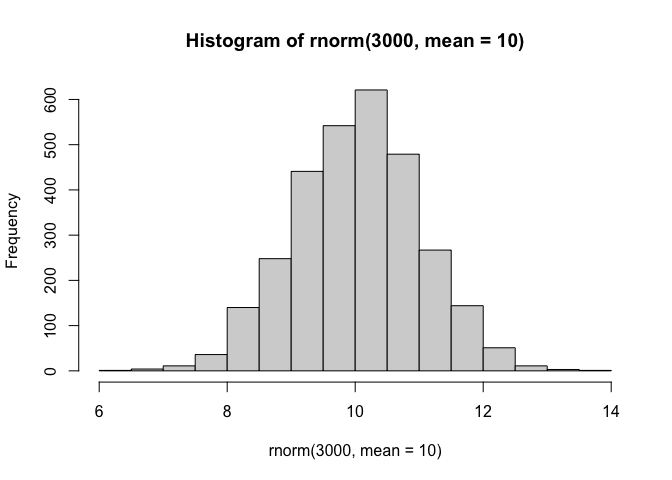
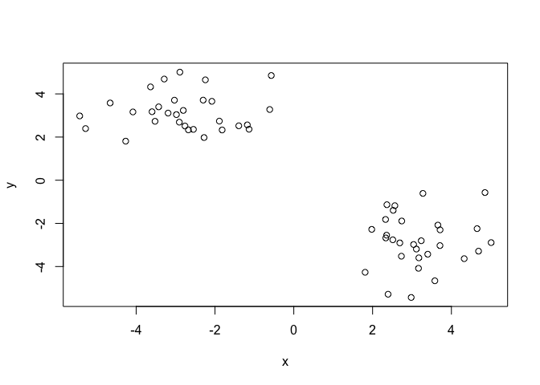
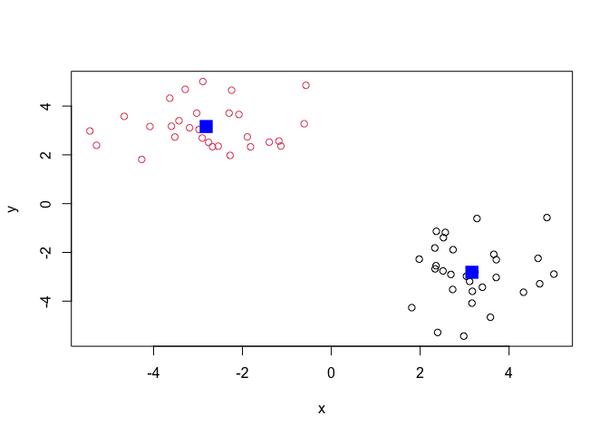
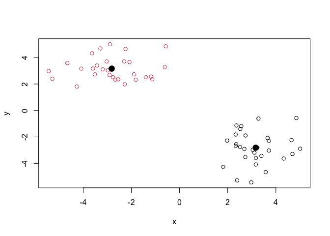
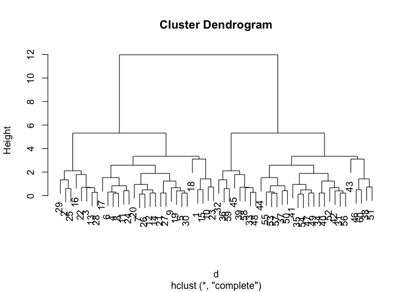
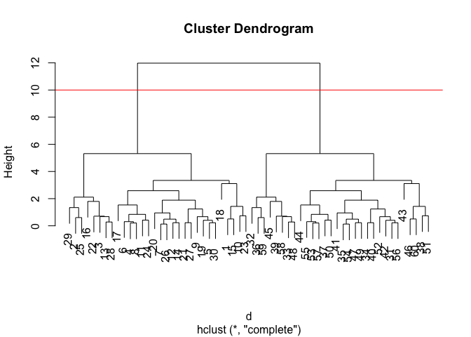
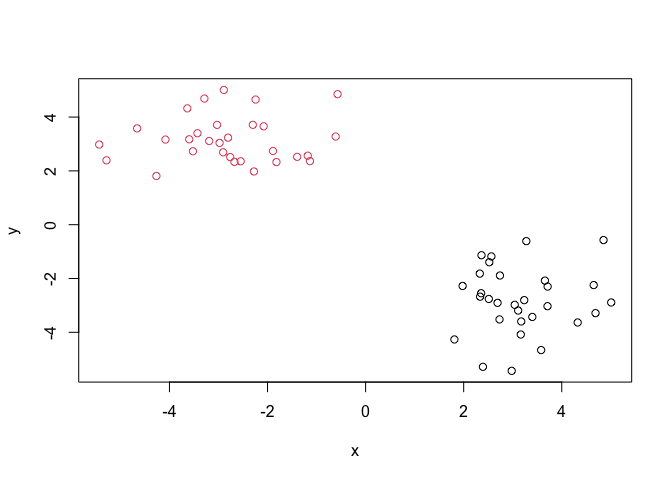
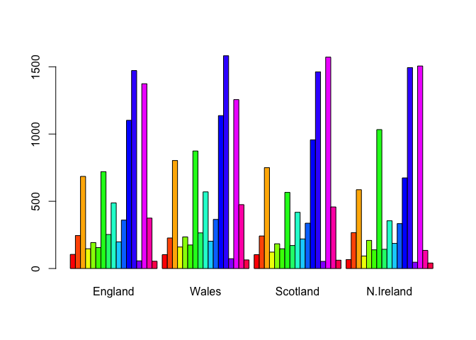
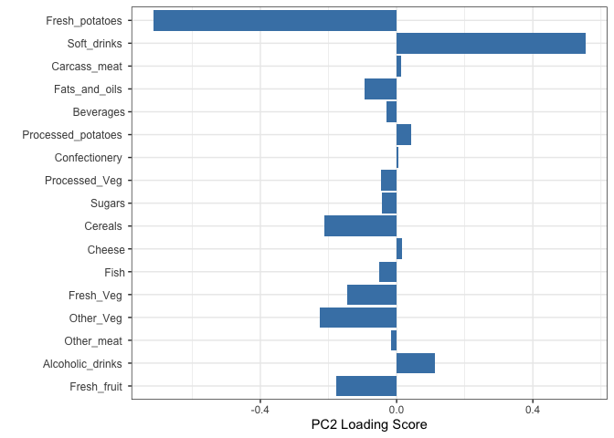

# bimm143_lab7R
Malibu Slattery (A18488012)

- [Background](#background)
- [K means clustering is fast and relatively
  straightforward.](#k-means-clustering-is-fast-and-relatively-straightforward)
- [Hierarchical clustering](#hierarchical-clustering)
- [Principal Component Analysis
  (PCA)](#principal-component-analysis-pca)
  - [PCA of UK food data](#pca-of-uk-food-data)
- [Skip question 4](#skip-question-4)

## Background

Today we will begin our exploration of some important machine learning
with a focus on **clustering** and **dimensionality reduction**.

To start testing these methods, let’s make up some sample data to
cluster, where we known what the answer should be.

``` r
hist(rnorm(3000, mean=10))
```



> Q. Can you generate 30 numbers centered at +3, taken at random from a
> normal distribution?

``` r
temp<- c(rnorm(30, mean = 3), rnorm(30, mean = -3))
temp
```

     [1]  4.3243839  2.9793425  2.7307958  2.3631067  3.0408150  2.5221544
     [7]  2.3350656  2.5648594  3.7094570  4.6514729  2.7398284  2.5127926
    [13]  3.1737523  2.6907814  4.6886640  1.8106671  3.2772420  4.8519925
    [19]  3.2343426  1.9781828  3.7119503  3.1645373  5.0082736  2.3288271
    [25]  2.3926123  2.3557552  3.6565970  3.3992966  3.5795621  3.1111933
    [31] -3.1902184 -4.6600118 -3.4292194 -2.0789571 -2.5472918 -5.2840902
    [37] -1.8182513 -2.8908785 -4.0823813 -2.3000522 -2.2769511 -2.8045161
    [43] -0.5712954 -0.6108653 -4.2662233 -3.2877959 -2.9047899 -3.5968564
    [49] -2.7612510 -1.8890465 -2.2439529 -3.0292561 -1.1795204 -2.6749565
    [55] -1.3960528 -2.9785212 -1.1351900 -3.5212080 -5.4327181 -3.6353513

``` r
#using `c()` joins the two rnorms
a<-cbind(x=temp, y=rev(temp))
plot(a)
```



``` r
#cbind combines columns given by x and ys into a table. 
#rbind binds rows
```

## K means clustering is fast and relatively straightforward.

The main function in “base R” is called `kmeans()`.

``` r
b<-kmeans(a, centers=2)
b
```

    K-means clustering with 2 clusters of sizes 30, 30

    Cluster means:
              x         y
    1  3.162943 -2.815922
    2 -2.815922  3.162943

    Clustering vector:
     [1] 1 1 1 1 1 1 1 1 1 1 1 1 1 1 1 1 1 1 1 1 1 1 1 1 1 1 1 1 1 1 2 2 2 2 2 2 2 2
    [39] 2 2 2 2 2 2 2 2 2 2 2 2 2 2 2 2 2 2 2 2 2 2

    Within cluster sum of squares by cluster:
    [1] 65.01763 65.01763
     (between_SS / total_SS =  89.2 %)

    Available components:

    [1] "cluster"      "centers"      "totss"        "withinss"     "tot.withinss"
    [6] "betweenss"    "size"         "iter"         "ifault"      

``` r
#clustering vector = the first 30 points of a data set lies in a specific cluster
#within clusters sum of squares => distance to the center
#available components => if you saved the object, you have the list of objects to access. eg:b$centers
```

> Q. What component of your result object has the cluster centers?

``` r
b$centers
```

              x         y
    1  3.162943 -2.815922
    2 -2.815922  3.162943

> Q. What component of your result object has the cluster size (i.e: how
> many points are in each vector)?

``` r
b$size
```

    [1] 30 30

> Q. What component of your result object has the cluster membership
> vector (i.e. the main result of clustering: which points are in which
> cluster?

``` r
b$cluster
```

     [1] 1 1 1 1 1 1 1 1 1 1 1 1 1 1 1 1 1 1 1 1 1 1 1 1 1 1 1 1 1 1 2 2 2 2 2 2 2 2
    [39] 2 2 2 2 2 2 2 2 2 2 2 2 2 2 2 2 2 2 2 2 2 2

> Q. Plot the results of clustering (i.e our data colored by the
> clustering result) along with the cluster centers.

``` r
#plot(a, col = c("red", "blue")) recycles colors
plot(a, col = b$cluster)
points(b$centers, col="blue", pch=15, cex=2)
```



> Q. Can you run k means again and cluster into 4 centers and plot the
> results?

``` r
new<-kmeans(a, centers=2)
new
```

    K-means clustering with 2 clusters of sizes 30, 30

    Cluster means:
              x         y
    1  3.162943 -2.815922
    2 -2.815922  3.162943

    Clustering vector:
     [1] 1 1 1 1 1 1 1 1 1 1 1 1 1 1 1 1 1 1 1 1 1 1 1 1 1 1 1 1 1 1 2 2 2 2 2 2 2 2
    [39] 2 2 2 2 2 2 2 2 2 2 2 2 2 2 2 2 2 2 2 2 2 2

    Within cluster sum of squares by cluster:
    [1] 65.01763 65.01763
     (between_SS / total_SS =  89.2 %)

    Available components:

    [1] "cluster"      "centers"      "totss"        "withinss"     "tot.withinss"
    [6] "betweenss"    "size"         "iter"         "ifault"      

``` r
new$centers
```

              x         y
    1  3.162943 -2.815922
    2 -2.815922  3.162943

``` r
new$cluster
```

     [1] 1 1 1 1 1 1 1 1 1 1 1 1 1 1 1 1 1 1 1 1 1 1 1 1 1 1 1 1 1 1 2 2 2 2 2 2 2 2
    [39] 2 2 2 2 2 2 2 2 2 2 2 2 2 2 2 2 2 2 2 2 2 2

``` r
plot(a, col = new$cluster)
points(new$centers, col = "black", pch = 20, cex = 2, lwd= 3)
```



> **Key point:** Kmeans will always return with the clustering that we
> asked for (this is the “K” or “center” in k-means)

``` r
b$tot.withinss
```

    [1] 130.0353

## Hierarchical clustering

The main function to do this in base r is called `hclust()`. One of the
main differences between this and the `kmeans()` function is that you
cannot just pass your input data directly to `hclust()`. It needs a
“distance/dissimilarity matrix”. We can get this from lots of places,
including the `dist()` function, which calculates it for you.

``` r
d<-dist(a, diag = TRUE)
hc<-hclust(d)
hc
```


    Call:
    hclust(d = d)

    Cluster method   : complete 
    Distance         : euclidean 
    Number of objects: 60 

``` r
plot(hc)
```



``` r
#HC treats each point as its own cluster and creates a matrix in relation to other points
```

We can “cut” the dendrogram or “tree” at a given point to yeild our
clusters. For this, we use the function `cutree()`.

``` r
plot(hc)
abline(h=10, col="red")
```



> Q. Plot our data `a` colored by the clusterinv result from `hclust()`
> and `cutree()`.

``` r
tree<-cutree(hc, h=10)
tree
```

     [1] 1 1 1 1 1 1 1 1 1 1 1 1 1 1 1 1 1 1 1 1 1 1 1 1 1 1 1 1 1 1 2 2 2 2 2 2 2 2
    [39] 2 2 2 2 2 2 2 2 2 2 2 2 2 2 2 2 2 2 2 2 2 2

``` r
plot(a, col=tree)
```



## Principal Component Analysis (PCA)

PCA is a popular dimensionality reduction technique that is widely used
in bioinformatics.

### PCA of UK food data

Start the lab sheet…

**Data Import**

``` r
library(ggplot2)
url = "https://tinyurl.com/UK-foods"
x<-read.csv(url)
x
```

                         X England Wales Scotland N.Ireland
    1               Cheese     105   103      103        66
    2        Carcass_meat      245   227      242       267
    3          Other_meat      685   803      750       586
    4                 Fish     147   160      122        93
    5       Fats_and_oils      193   235      184       209
    6               Sugars     156   175      147       139
    7      Fresh_potatoes      720   874      566      1033
    8           Fresh_Veg      253   265      171       143
    9           Other_Veg      488   570      418       355
    10 Processed_potatoes      198   203      220       187
    11      Processed_Veg      360   365      337       334
    12        Fresh_fruit     1102  1137      957       674
    13            Cereals     1472  1582     1462      1494
    14           Beverages      57    73       53        47
    15        Soft_drinks     1374  1256     1572      1506
    16   Alcoholic_drinks      375   475      458       135
    17      Confectionery       54    64       62        41

``` r
dim(x)
```

    [1] 17  5

``` r
x<-read.csv(url, row.names =1)
head(x)
```

                   England Wales Scotland N.Ireland
    Cheese             105   103      103        66
    Carcass_meat       245   227      242       267
    Other_meat         685   803      750       586
    Fish               147   160      122        93
    Fats_and_oils      193   235      184       209
    Sugars             156   175      147       139

It looks like the row names are not set properly…we can fix this!
**Checking your data**

``` r
head(x)
```

                   England Wales Scotland N.Ireland
    Cheese             105   103      103        66
    Carcass_meat       245   227      242       267
    Other_meat         685   803      750       586
    Fish               147   160      122        93
    Fats_and_oils      193   235      184       209
    Sugars             156   175      147       139

``` r
rownames(x) <- x[,1]
```

**Bad way to do this:**

- x\<-x\[,-1\]

> Q1. Which approach to solving the ‘row-names problem’ mentioned above
> do you prefer and why? Is one approach more robust than another under
> certain circumstances?

**Better way to do this:**

``` r
y<-read.csv(url, row.names = 1)
y
```

                        England Wales Scotland N.Ireland
    Cheese                  105   103      103        66
    Carcass_meat            245   227      242       267
    Other_meat              685   803      750       586
    Fish                    147   160      122        93
    Fats_and_oils           193   235      184       209
    Sugars                  156   175      147       139
    Fresh_potatoes          720   874      566      1033
    Fresh_Veg               253   265      171       143
    Other_Veg               488   570      418       355
    Processed_potatoes      198   203      220       187
    Processed_Veg           360   365      337       334
    Fresh_fruit            1102  1137      957       674
    Cereals                1472  1582     1462      1494
    Beverages                57    73       53        47
    Soft_drinks            1374  1256     1572      1506
    Alcoholic_drinks        375   475      458       135
    Confectionery            54    64       62        41

> ans: I prefer setting `rownames =`. We will continually be overriding
> x and removing important columns otherwise.

> Q2. How many rows and columns are in your new data frame named x? What
> R functions could you use to answer this questions??

``` r
dim(y)
```

    [1] 17  4

``` r
y
```

                        England Wales Scotland N.Ireland
    Cheese                  105   103      103        66
    Carcass_meat            245   227      242       267
    Other_meat              685   803      750       586
    Fish                    147   160      122        93
    Fats_and_oils           193   235      184       209
    Sugars                  156   175      147       139
    Fresh_potatoes          720   874      566      1033
    Fresh_Veg               253   265      171       143
    Other_Veg               488   570      418       355
    Processed_potatoes      198   203      220       187
    Processed_Veg           360   365      337       334
    Fresh_fruit            1102  1137      957       674
    Cereals                1472  1582     1462      1494
    Beverages                57    73       53        47
    Soft_drinks            1374  1256     1572      1506
    Alcoholic_drinks        375   475      458       135
    Confectionery            54    64       62        41

> ans: 17 x 4, using `dim()`.

**Spotting Major Differences and Trends**

``` r
barplot(as.matrix(y), beside = T, col = rainbow(nrow(x)))
```



> Q3. Changing what optional argument in the above barplot() function
> results in the following plot?

``` r
barplot(as.matrix(y), beside = F, col = rainbow(nrow(x)))
```


> ans: `beside = T` =\> `beside = F`.

# Skip question 4

**Pairs plots and heatmaps**

> Q5. We can use the pairs() function to generate all pairwise plots for
> our countries. Can you make sense of the following code and resulting
> figure? What does it mean if a given point lies on the diagonal for a
> given plot?

``` r
pairs(y, col=rainbow(nrow(x)), pch=16)
```


Wales v England, Wales v Scotland, etc. Flipped….

> ans: If they all lined against the exact diagonal, it would mean the
> two regions are equal in consumption for a given food item.

``` r
library(pheatmap)
pheatmap( as.matrix(y) )
```


> Q6. Based on the pairs and heatmap figures, which countries cluster
> together and what does this suggest about their food consumption
> patterns? Can you easily tell what the main differences between N.
> Ireland and the other countries of the UK in terms of this data-set?

> ans: All regions are pretty high in cereal consumption and fairly low
> in confectionaries and beverages.

Of all these plots, really only the `pairs()` plot was useful. This,
however, took a bit of work to interpret amd will ot scale when I am
looking at much bigger datasets.

**PCA to the rescue**

The main function in “base R” for PCA is the `prcomp()` function.

``` r
pca <- prcomp( t(y) )
summary(pca)
```

    Importance of components:
                                PC1      PC2      PC3     PC4
    Standard deviation     324.1502 212.7478 73.87622 2.7e-14
    Proportion of Variance   0.6744   0.2905  0.03503 0.0e+00
    Cumulative Proportion    0.6744   0.9650  1.00000 1.0e+00

``` r
#POV describes how much of the differences are explained by PC1. If PC1 was a line that shot through all of the data as best it could, 67% of the differences would be explained.
```

> Q7. Complete the code below to generate a plot of PC1 vs PC2. The
> second line adds text labels over the data points. How much variance
> is captured by the first pc? How many PCs do I need to capture 90% of
> the data?

> ans: 67.4%, 2 PCs captured 96.5%

``` r
# Create a data frame for plotting
df <- as.data.frame(pca$x)
df$Country <- rownames(df)

# Plot PC1 vs PC2 with ggplot
ggplot(pca$x) +
  aes(x = PC1, y = PC2, label = rownames(pca$x)) +
  geom_point(size = 3) +
  geom_text(vjust = -0.5) +
  xlim(-270, 500) +
  xlab("PC1") +
  ylab("PC2") +
  theme_bw()
```


``` r
attributes(pca)
```

    $names
    [1] "sdev"     "rotation" "center"   "scale"    "x"       

    $class
    [1] "prcomp"

``` r
#To generate our pca plot, we need pca$x
pca$x
```

                     PC1         PC2        PC3           PC4
    England   -144.99315   -2.532999 105.768945  1.612425e-14
    Wales     -240.52915 -224.646925 -56.475555  4.751043e-13
    Scotland   -91.86934  286.081786 -44.415495 -6.044349e-13
    N.Ireland  477.39164  -58.901862  -4.877895  1.145386e-13

``` r
my_cols <- c("orange", "red", "blue", "darkgreen")
plot(pca$x[,1], pca$x[,2], col = my_cols, pch=16)
```


``` r
ggplot(pca$x) +
  aes(PC1, PC2) +
  geom_point(col=my_cols)
```


**Digging Deeper (variable loadings)**

How do the original variables (i.e. the 17 different foods) contribute
to our new PCs?

``` r
ggplot(pca$rotation) +
  aes(x = PC1, 
      y = reorder(rownames(pca$rotation), PC1)) +
  geom_col(fill = "steelblue") +
  xlab("PC1 Loading Score") +
  ylab("") +
  theme_bw() +
  theme(axis.text.y = element_text(size = 9))
```


> Q9: Generate a similar ‘loadings plot’ for PC2. What two food groups
> feature prominantely and what does PC2 maninly tell us about? ans:
> Potatoes and soft drinks. PC2 tells us the second most influential
> variables on the variance of the data come from the potatoes and soft
> drinks.

``` r
ggplot(pca$rotation) +
  aes(x = PC2, 
      y = reorder(rownames(pca$rotation), PC1)) +
  geom_col(fill = "steelblue") +
  xlab("PC2 Loading Score") +
  ylab("") +
  theme_bw() +
  theme(axis.text.y = element_text(size = 9))
```


