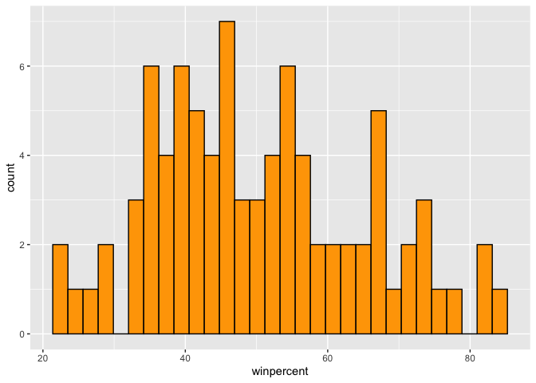
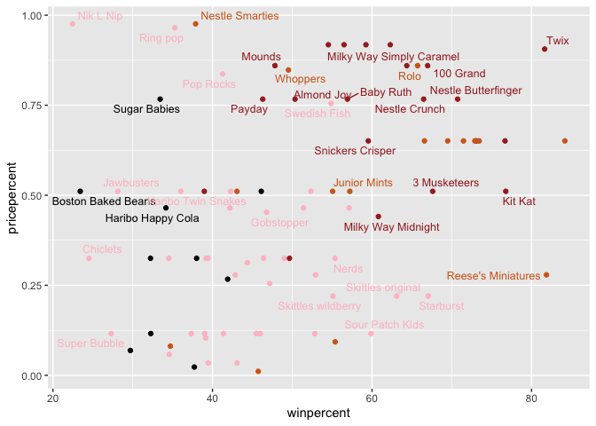
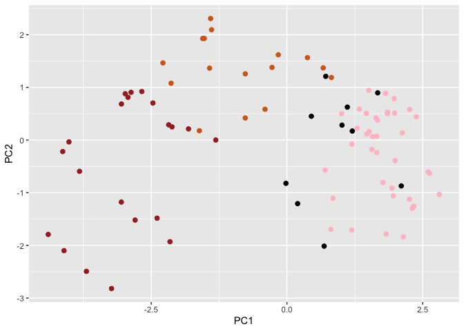
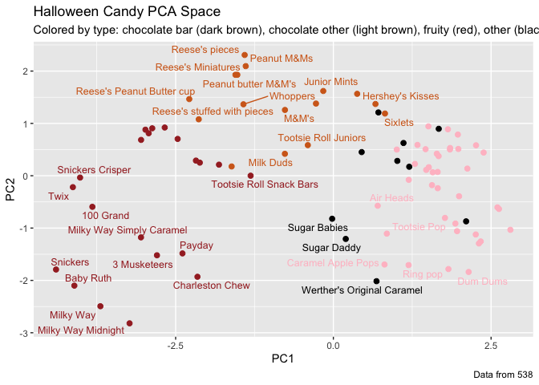

# Class 9: Halloween Mini-Project
Malibu Slattery (A18488012)

- [2. Importing candy data](#2-importing-candy-data)
- [2.2 What is your favorite candy?](#22-what-is-your-favorite-candy)
- [Side-note: the skimr::skim()
  function](#side-note-the-skimrskim-function)
  - [3. Exploratory analysis](#3-exploratory-analysis)
  - [4. Overall Candy Rankings](#4-overall-candy-rankings)
  - [5. Taking a look at pricepercent](#5-taking-a-look-at-pricepercent)
  - [6 Exploring the correlation
    structure](#6-exploring-the-correlation-structure)
  - [7 Principal Component Analysis](#7-principal-component-analysis)
  - [8. Summary](#8-summary)

## 2. Importing candy data

``` r
candy_file <- "candy-data.csv"

candy = read.csv(candy_file, row.names=1)
head(candy)
```

                 chocolate fruity caramel peanutyalmondy nougat crispedricewafer
    100 Grand            1      0       1              0      0                1
    3 Musketeers         1      0       0              0      1                0
    One dime             0      0       0              0      0                0
    One quarter          0      0       0              0      0                0
    Air Heads            0      1       0              0      0                0
    Almond Joy           1      0       0              1      0                0
                 hard bar pluribus sugarpercent pricepercent winpercent
    100 Grand       0   1        0        0.732        0.860   66.97173
    3 Musketeers    0   1        0        0.604        0.511   67.60294
    One dime        0   0        0        0.011        0.116   32.26109
    One quarter     0   0        0        0.011        0.511   46.11650
    Air Heads       0   0        0        0.906        0.511   52.34146
    Almond Joy      0   1        0        0.465        0.767   50.34755

> Q1. How many different candy types are in this dataset?

``` r
nrow(candy)
```

    [1] 85

> ans: 85

> Q2. How many fruity candy types are in the dataset?

``` r
colSums(candy["fruity"])
```

    fruity 
        38 

> ans: 38

``` r
rownames(candy)
```

     [1] "100 Grand"                   "3 Musketeers"               
     [3] "One dime"                    "One quarter"                
     [5] "Air Heads"                   "Almond Joy"                 
     [7] "Baby Ruth"                   "Boston Baked Beans"         
     [9] "Candy Corn"                  "Caramel Apple Pops"         
    [11] "Charleston Chew"             "Chewey Lemonhead Fruit Mix" 
    [13] "Chiclets"                    "Dots"                       
    [15] "Dum Dums"                    "Fruit Chews"                
    [17] "Fun Dip"                     "Gobstopper"                 
    [19] "Haribo Gold Bears"           "Haribo Happy Cola"          
    [21] "Haribo Sour Bears"           "Haribo Twin Snakes"         
    [23] "Hershey's Kisses"            "Hershey's Krackel"          
    [25] "Hershey's Milk Chocolate"    "Hershey's Special Dark"     
    [27] "Jawbusters"                  "Junior Mints"               
    [29] "Kit Kat"                     "Laffy Taffy"                
    [31] "Lemonhead"                   "Lifesavers big ring gummies"
    [33] "Peanut butter M&M's"         "M&M's"                      
    [35] "Mike & Ike"                  "Milk Duds"                  
    [37] "Milky Way"                   "Milky Way Midnight"         
    [39] "Milky Way Simply Caramel"    "Mounds"                     
    [41] "Mr Good Bar"                 "Nerds"                      
    [43] "Nestle Butterfinger"         "Nestle Crunch"              
    [45] "Nik L Nip"                   "Now & Later"                
    [47] "Payday"                      "Peanut M&Ms"                
    [49] "Pixie Sticks"                "Pop Rocks"                  
    [51] "Red vines"                   "Reese's Miniatures"         
    [53] "Reese's Peanut Butter cup"   "Reese's pieces"             
    [55] "Reese's stuffed with pieces" "Ring pop"                   
    [57] "Rolo"                        "Root Beer Barrels"          
    [59] "Runts"                       "Sixlets"                    
    [61] "Skittles original"           "Skittles wildberry"         
    [63] "Nestle Smarties"             "Smarties candy"             
    [65] "Snickers"                    "Snickers Crisper"           
    [67] "Sour Patch Kids"             "Sour Patch Tricksters"      
    [69] "Starburst"                   "Strawberry bon bons"        
    [71] "Sugar Babies"                "Sugar Daddy"                
    [73] "Super Bubble"                "Swedish Fish"               
    [75] "Tootsie Pop"                 "Tootsie Roll Juniors"       
    [77] "Tootsie Roll Midgies"        "Tootsie Roll Snack Bars"    
    [79] "Trolli Sour Bites"           "Twix"                       
    [81] "Twizzlers"                   "Warheads"                   
    [83] "Welch's Fruit Snacks"        "Werther's Original Caramel" 
    [85] "Whoppers"                   

## 2.2 What is your favorite candy?

``` r
candy["Red vines", ]$winpercent
```

    [1] 37.34852

``` r
candy["Kit Kat", ]$winpercent
```

    [1] 76.7686

``` r
candy["Tootsie Roll Snack Bars", ]$winpercent
```

    [1] 49.6535

``` r
library(dplyr)
```


    Attaching package: 'dplyr'

    The following objects are masked from 'package:stats':

        filter, lag

    The following objects are masked from 'package:base':

        intersect, setdiff, setequal, union

``` r
candy |> 
  filter(row.names(candy)=="Twix") |> 
  select(winpercent)
```

         winpercent
    Twix   81.64291

> Q3. What is your favorite candy (other than Twix) in the dataset and
> what is it’s winpercent value?

    >ans: 37.34852

> Q4. What is the winpercent value for “Kit Kat”?

    >ans: 76.7686

> Q5. What is the winpercent value for “Tootsie Roll Snack Bars”?

    >ans: 49.6535

# Side-note: the skimr::skim() function

``` r
library("skimr")
skim(candy)
```

|                                                  |       |
|:-------------------------------------------------|:------|
| Name                                             | candy |
| Number of rows                                   | 85    |
| Number of columns                                | 12    |
| \_\_\_\_\_\_\_\_\_\_\_\_\_\_\_\_\_\_\_\_\_\_\_   |       |
| Column type frequency:                           |       |
| numeric                                          | 12    |
| \_\_\_\_\_\_\_\_\_\_\_\_\_\_\_\_\_\_\_\_\_\_\_\_ |       |
| Group variables                                  | None  |

Data summary

**Variable type: numeric**

| skim_variable | n_missing | complete_rate | mean | sd | p0 | p25 | p50 | p75 | p100 | hist |
|:---|---:|---:|---:|---:|---:|---:|---:|---:|---:|:---|
| chocolate | 0 | 1 | 0.44 | 0.50 | 0.00 | 0.00 | 0.00 | 1.00 | 1.00 | ▇▁▁▁▆ |
| fruity | 0 | 1 | 0.45 | 0.50 | 0.00 | 0.00 | 0.00 | 1.00 | 1.00 | ▇▁▁▁▆ |
| caramel | 0 | 1 | 0.16 | 0.37 | 0.00 | 0.00 | 0.00 | 0.00 | 1.00 | ▇▁▁▁▂ |
| peanutyalmondy | 0 | 1 | 0.16 | 0.37 | 0.00 | 0.00 | 0.00 | 0.00 | 1.00 | ▇▁▁▁▂ |
| nougat | 0 | 1 | 0.08 | 0.28 | 0.00 | 0.00 | 0.00 | 0.00 | 1.00 | ▇▁▁▁▁ |
| crispedricewafer | 0 | 1 | 0.08 | 0.28 | 0.00 | 0.00 | 0.00 | 0.00 | 1.00 | ▇▁▁▁▁ |
| hard | 0 | 1 | 0.18 | 0.38 | 0.00 | 0.00 | 0.00 | 0.00 | 1.00 | ▇▁▁▁▂ |
| bar | 0 | 1 | 0.25 | 0.43 | 0.00 | 0.00 | 0.00 | 0.00 | 1.00 | ▇▁▁▁▂ |
| pluribus | 0 | 1 | 0.52 | 0.50 | 0.00 | 0.00 | 1.00 | 1.00 | 1.00 | ▇▁▁▁▇ |
| sugarpercent | 0 | 1 | 0.48 | 0.28 | 0.01 | 0.22 | 0.47 | 0.73 | 0.99 | ▇▇▇▇▆ |
| pricepercent | 0 | 1 | 0.47 | 0.29 | 0.01 | 0.26 | 0.47 | 0.65 | 0.98 | ▇▇▇▇▆ |
| winpercent | 0 | 1 | 50.32 | 14.71 | 22.45 | 39.14 | 47.83 | 59.86 | 84.18 | ▃▇▆▅▂ |

> Q6. Is there any variable/column that looks to be on a different scale
> to the majority of the other columns in the dataset?

    >ans: columns n_missing and complete_rate, and row winpercent

> Q7. What do you think a zero and one represent for the
> candy\$chocolate column?

    >ans: Whether or not the candy has chocolate.

## 3. Exploratory analysis

> Q8. Plot a histogram of winpercent values

``` r
hist(candy$winpercent)
```


``` r
library("ggplot2")
ggplot(candy, aes(winpercent)) + geom_histogram(fill="orange", col = "black")
```

    `stat_bin()` using `bins = 30`. Pick better value `binwidth`.



``` r
candy$winpercent[as.logical(candy$nougat)]
```

    [1] 67.60294 56.91455 38.97504 73.09956 60.80070 46.29660 76.67378

> Q9. Is the distribution of winpercent values symmetrical?

    > ans: No, it's a bit right skewed.

> Q10. Is the center of the distribution above or below 50%?

``` r
mean(candy$winpercent)
```

    [1] 50.31676

``` r
summary(candy$winpercent)
```

       Min. 1st Qu.  Median    Mean 3rd Qu.    Max. 
      22.45   39.14   47.83   50.32   59.86   84.18 

    > ans: The center is just barely below 50% (47.83)

> Q11. On average is chocolate candy higher or lower ranked than fruit
> candy?

``` r
mean(candy$chocolate)
```

    [1] 0.4352941

``` r
mean(candy$fruity)
```

    [1] 0.4470588

    > ans: 0.4352941 (chocolate) < **0.4470588 (fruity)**

> Q12. Is this difference statistically significant?

``` r
choco <- candy$winpercent[as.logical(candy$chocolate)]
fruit <- candy$winpercent[as.logical(candy$fruity)]
t.test(choco, fruit)
```


        Welch Two Sample t-test

    data:  choco and fruit
    t = 6.2582, df = 68.882, p-value = 2.871e-08
    alternative hypothesis: true difference in means is not equal to 0
    95 percent confidence interval:
     11.44563 22.15795
    sample estimates:
    mean of x mean of y 
     60.92153  44.11974 

    >ans: Yes, the results are satistically  (p-value = 2.871e-08)

## 4. Overall Candy Rankings

> Q13. What are the five least liked candy types in this set?

``` r
library(dplyr)

head(candy[order(candy$winpercent),], n=5)
```

                       chocolate fruity caramel peanutyalmondy nougat
    Nik L Nip                  0      1       0              0      0
    Boston Baked Beans         0      0       0              1      0
    Chiclets                   0      1       0              0      0
    Super Bubble               0      1       0              0      0
    Jawbusters                 0      1       0              0      0
                       crispedricewafer hard bar pluribus sugarpercent pricepercent
    Nik L Nip                         0    0   0        1        0.197        0.976
    Boston Baked Beans                0    0   0        1        0.313        0.511
    Chiclets                          0    0   0        1        0.046        0.325
    Super Bubble                      0    0   0        0        0.162        0.116
    Jawbusters                        0    1   0        1        0.093        0.511
                       winpercent
    Nik L Nip            22.44534
    Boston Baked Beans   23.41782
    Chiclets             24.52499
    Super Bubble         27.30386
    Jawbusters           28.12744

``` r
l<- candy |> arrange(winpercent) |> head(5)
rownames(l)
```

    [1] "Nik L Nip"          "Boston Baked Beans" "Chiclets"          
    [4] "Super Bubble"       "Jawbusters"        

      >ans: Nik L Nip, Boston Baked Beans, Chiclets, Super Bubble, Jawbusters

``` r
m<-candy |> arrange(-winpercent) |> head(5)
k<-rownames(m)
noquote(k)
```

    [1] Reese's Peanut Butter cup Reese's Miniatures       
    [3] Twix                      Kit Kat                  
    [5] Snickers                 

> Q14. What are the top 5 all time favorite candy types out of this set?

      > ans: Reese's Peanut Butter cup, Reese's Miniatures, Twix, Kit Kat, Snickers 
      

> Q15. Make a first barplot of candy ranking based on winpercent values.

``` r
library(ggplot2)
ggplot(candy, aes(winpercent, rownames(candy))) + geom_col()
```


``` r
library(ggplot2)
ggplot(candy, aes(winpercent, reorder(rownames(candy),winpercent))) + geom_col()
```


\##4.0.1 Time to add some useful color

``` r
my_cols=rep("black", nrow(candy))
my_cols[as.logical(candy$chocolate)] = "chocolate"
my_cols[as.logical(candy$bar)] = "brown"
my_cols[as.logical(candy$fruity)] = "pink"

ggplot(candy) + 
  aes(winpercent, reorder(rownames(candy),winpercent)) +
  geom_col(fill=my_cols) 
```


> Q17. What is the worst ranked chocolate candy? ans: Sixlets Q18. What
> is the best ranked fruity candy? ans: Starburst

## 5. Taking a look at pricepercent

``` r
library(ggrepel)

# How about a plot of win vs price
ggplot(candy) +
  aes(winpercent, pricepercent, label=rownames(candy)) +
  geom_point(col=my_cols) + 
  geom_text_repel(col=my_cols, size=3.3, max.overlaps = 5)
```



> Q19. Which candy type is the highest ranked in terms of winpercent for
> the least money - i.e. offers the most bang for your buck? ans:
> Reese’s Miniratures

> Q20. What are the top 5 most expensive candy types in the dataset and
> of these which is the least popular? ans: Nik L Nip, Nestle Smarties,
> Ring Pop, Mr. Goodbar, Twix. Nik L Nip is the least popular.

## 6 Exploring the correlation structure

``` r
library(corrplot)
```

    corrplot 0.95 loaded

``` r
cij <- cor(candy)
corrplot(cij)
```


> Q22. Examining this plot what two variables are anti-correlated
> (i.e. have minus values)? ans: chocolate aqnd fruity

> Q23. Similarly, what two variables are most positively correlated?
> ans: chocolate and win percent

## 7 Principal Component Analysis

``` r
pca <- prcomp(candy, scale= TRUE)
summary(pca)
```

    Importance of components:
                              PC1    PC2    PC3     PC4    PC5     PC6     PC7
    Standard deviation     2.0788 1.1378 1.1092 1.07533 0.9518 0.81923 0.81530
    Proportion of Variance 0.3601 0.1079 0.1025 0.09636 0.0755 0.05593 0.05539
    Cumulative Proportion  0.3601 0.4680 0.5705 0.66688 0.7424 0.79830 0.85369
                               PC8     PC9    PC10    PC11    PC12
    Standard deviation     0.74530 0.67824 0.62349 0.43974 0.39760
    Proportion of Variance 0.04629 0.03833 0.03239 0.01611 0.01317
    Cumulative Proportion  0.89998 0.93832 0.97071 0.98683 1.00000

``` r
plot(pca$x[,1:2])
```


``` r
plot(pca$x[,1:2], col=my_cols, pch=16)
```


score plot…

``` r
r<-ggplot(pca$x) +
  aes(x=PC1, y= PC2) +
  geom_point(col = my_cols)
```

``` r
# Make a new data-frame with our PCA results and candy data
my_data <- cbind(candy, pca$x[,1:3])

p <- ggplot(my_data) + 
        aes(x=PC1, y=PC2, 
            size=winpercent/100,  
            text=rownames(my_data),
            label=rownames(my_data)) +
        geom_point(col=my_cols, size =2)

p
```



``` r
library(ggrepel)


p + geom_text_repel(size=3.3, col=my_cols, max.overlaps = 5)  + 
  theme(legend.position = "none") +
  labs(title="Halloween Candy PCA Space",
       subtitle="Colored by type: chocolate bar (dark brown), chocolate other (light brown), fruity (red), other (black)",
       caption="Data from 538")
```



``` r
ggplot(pca$rotation) +
  aes(PC1, reorder(rownames(pca$rotation), PC1)) +
  geom_col()
```


``` r
#library(plotly)
#ggplotly(r)
```

If you’re chocolate, you’re more likely to be caramel, expensive, a bar,
have more sugar…

> Q24. Complete the code to generate the loadings plot above. What
> original variables are picked up strongly by PC1 in the positive
> direction? Do these make sense to you? Where did you see this
> relationship highlighted previously?

      > ans: Fruity, pluribus and hard. Yes! These make sense and they were in the heaat-map like corrlative figure. 
      

## 8. Summary

> Q25. Based on your exploratory analysis, correlation findings, and PCA
> results, what combination of characteristics appears to make a
> “winning” candy? How do these different analyses (visualization,
> correlation, PCA) support or complement each other in reaching this
> conclusion?

      > ans: Being chocolatey, more expensive, in bar form, having more sugar, etc...The different analysis show relationships in different lights and therefore help paint a complete picture, enough to synthesize relationships.

Just seeing what the data looks like….

``` r
losers = candy[which(candy$winpercent < 50),]
head(losers)
```

                       chocolate fruity caramel peanutyalmondy nougat
    One dime                   0      0       0              0      0
    One quarter                0      0       0              0      0
    Boston Baked Beans         0      0       0              1      0
    Candy Corn                 0      0       0              0      0
    Caramel Apple Pops         0      1       1              0      0
    Charleston Chew            1      0       0              0      1
                       crispedricewafer hard bar pluribus sugarpercent pricepercent
    One dime                          0    0   0        0        0.011        0.116
    One quarter                       0    0   0        0        0.011        0.511
    Boston Baked Beans                0    0   0        1        0.313        0.511
    Candy Corn                        0    0   0        1        0.906        0.325
    Caramel Apple Pops                0    0   0        0        0.604        0.325
    Charleston Chew                   0    0   1        0        0.604        0.511
                       winpercent
    One dime             32.26109
    One quarter          46.11650
    Boston Baked Beans   23.41782
    Candy Corn           38.01096
    Caramel Apple Pops   34.51768
    Charleston Chew      38.97504

``` r
winners = candy[which(candy$winpercent >= 50),]
head(winners)
```

                      chocolate fruity caramel peanutyalmondy nougat
    100 Grand                 1      0       1              0      0
    3 Musketeers              1      0       0              0      1
    Air Heads                 0      1       0              0      0
    Almond Joy                1      0       0              1      0
    Baby Ruth                 1      0       1              1      1
    Haribo Gold Bears         0      1       0              0      0
                      crispedricewafer hard bar pluribus sugarpercent pricepercent
    100 Grand                        1    0   1        0        0.732        0.860
    3 Musketeers                     0    0   1        0        0.604        0.511
    Air Heads                        0    0   0        0        0.906        0.511
    Almond Joy                       0    0   1        0        0.465        0.767
    Baby Ruth                        0    0   1        0        0.604        0.767
    Haribo Gold Bears                0    0   0        1        0.465        0.465
                      winpercent
    100 Grand           66.97173
    3 Musketeers        67.60294
    Air Heads           52.34146
    Almond Joy          50.34755
    Baby Ruth           56.91455
    Haribo Gold Bears   57.11974
