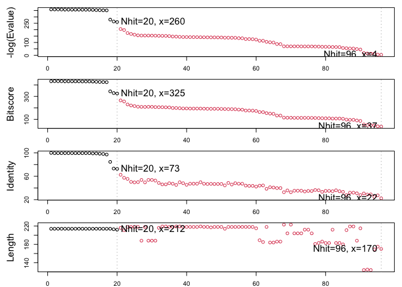

# bimm143_lab10
Malibu Slattery (A18488012)

- [1. Introduction to the RCSB Protein Data Bank
  (PDB)](#1-introduction-to-the-rcsb-protein-data-bank-pdb)
- [2. Visualizing the HIV-1 protease
  structure](#2-visualizing-the-hiv-1-protease-structure)
- [Bio3D Package for Structural
  Bioinformatics](#bio3d-package-for-structural-bioinformatics)
- [Predicting functional motions of a single
  structure](#predicting-functional-motions-of-a-single-structure)
  - [Feb 10th…resume…](#feb-10thresume)
  - [5. Comparative analysis with PCA](#5-comparative-analysis-with-pca)
  - [Align and superpose structures](#align-and-superpose-structures)

## 1. Introduction to the RCSB Protein Data Bank (PDB)

``` r
library(dplyr)
```


    Attaching package: 'dplyr'

    The following objects are masked from 'package:stats':

        filter, lag

    The following objects are masked from 'package:base':

        intersect, setdiff, setequal, union

``` r
library(tidyverse)
```

    ── Attaching core tidyverse packages ──────────────────────── tidyverse 2.0.0 ──
    ✔ forcats   1.0.1     ✔ readr     2.2.0
    ✔ ggplot2   4.0.2     ✔ stringr   1.6.0
    ✔ lubridate 1.9.5     ✔ tibble    3.3.1
    ✔ purrr     1.2.1     ✔ tidyr     1.3.2

    ── Conflicts ────────────────────────────────────────── tidyverse_conflicts() ──
    ✖ dplyr::filter() masks stats::filter()
    ✖ dplyr::lag()    masks stats::lag()
    ℹ Use the conflicted package (<http://conflicted.r-lib.org/>) to force all conflicts to become errors

``` r
pbd_data <- read.csv("pdb_stats.csv")
head(pbd_data)
```

               Molecular.Type   X.ray     EM    NMR Integrative Multiple.methods
    1          Protein (only) 178,795 21,825 12,773         343              226
    2 Protein/Oligosaccharide  10,363  3,564     34           8               11
    3              Protein/NA   9,106  6,335    287          24                7
    4     Nucleic acid (only)   3,132    221  1,566           3               15
    5                   Other     175     25     33           4                0
    6  Oligosaccharide (only)      11      0      6           0                1
      Neutron Other   Total
    1      84    32 214,078
    2       1     0  13,981
    3       0     0  15,759
    4       3     1   4,941
    5       0     0     237
    6       0     4      22

The commas in these numbers leads to the numbers here being read as
characters.

``` r
library(readr)
pbd_data_2<-read_csv("pdb_stats.csv")
```

    Rows: 6 Columns: 9
    ── Column specification ────────────────────────────────────────────────────────
    Delimiter: ","
    chr (1): Molecular Type
    dbl (4): Integrative, Multiple methods, Neutron, Other
    num (4): X-ray, EM, NMR, Total

    ℹ Use `spec()` to retrieve the full column specification for this data.
    ℹ Specify the column types or set `show_col_types = FALSE` to quiet this message.

``` r
head(pbd_data_2)
```

    # A tibble: 6 × 9
      `Molecular Type`    `X-ray`    EM   NMR Integrative `Multiple methods` Neutron
      <chr>                 <dbl> <dbl> <dbl>       <dbl>              <dbl>   <dbl>
    1 Protein (only)       178795 21825 12773         343                226      84
    2 Protein/Oligosacch…   10363  3564    34           8                 11       1
    3 Protein/NA             9106  6335   287          24                  7       0
    4 Nucleic acid (only)    3132   221  1566           3                 15       3
    5 Other                   175    25    33           4                  0       0
    6 Oligosaccharide (o…      11     0     6           0                  1       0
    # ℹ 2 more variables: Other <dbl>, Total <dbl>

``` r
xrayem<-sum(c(pbd_data_2$`X-ray`, pbd_data_2$`EM`))
xray<-sum(pbd_data_2$`X-ray`)
em<-sum(pbd_data_2$EM)
total<-sum(pbd_data_2$`Total`)
percentxray <- xray/total
percentem<-em/total
percentxrayem<-100*(xrayem/total)
percentxrayem
```

    [1] 93.7892

> Q1: What percentage of structures in the PDB are solved by X-Ray and
> Electron Microscopy.

      > ans: 93.8 for X-ray and EM total. 
      

``` r
100*(proteinstructures<-pbd_data_2[1,9]/total)
```

         Total
    1 85.96889

> Q2: What proportion of structures in the PDB are protein?

      > ans: 85.96%

> Q3: Type HIV in the PDB website search box on the home page and
> determine how many HIV-1 protease structures are in the current PDB?

      > ans: 1,173

## 2. Visualizing the HIV-1 protease structure


> Q4: Water molecules normally have 3 atoms. Why do we see just one atom
> per water molecule in this structure?

      > ans: We see one atom because the other components of the molecule are more important and we can imply that the smaller, less relevant pieces labeled 'water' are just that, smaller and less relevant. 

> Q5: There is a critical “conserved” water molecule in the binding
> site. Can you identify this water molecule? What residue number does
> this water molecule have?

      > ans: 1608

> Q6: Generate and save a figure clearly showing the two distinct chains
> of HIV-protease along with the ligand. You might also consider showing
> the catalytic residues ASP 25 in each chain and the critical water (we
> recommend “Ball & Stick” for these side-chains). Add this figure to
> your Quarto document.

      > ans: in the quarto

## Bio3D Package for Structural Bioinformatics

``` r
library(bio3d)

pdb <- read.pdb("1hsg")
```

      Note: Accessing on-line PDB file

``` r
pdb
```


     Call:  read.pdb(file = "1hsg")

       Total Models#: 1
         Total Atoms#: 1686,  XYZs#: 5058  Chains#: 2  (values: A B)

         Protein Atoms#: 1514  (residues/Calpha atoms#: 198)
         Nucleic acid Atoms#: 0  (residues/phosphate atoms#: 0)

         Non-protein/nucleic Atoms#: 172  (residues: 128)
         Non-protein/nucleic resid values: [ HOH (127), MK1 (1) ]

       Protein sequence:
          PQITLWQRPLVTIKIGGQLKEALLDTGADDTVLEEMSLPGRWKPKMIGGIGGFIKVRQYD
          QILIEICGHKAIGTVLVGPTPVNIIGRNLLTQIGCTLNFPQITLWQRPLVTIKIGGQLKE
          ALLDTGADDTVLEEMSLPGRWKPKMIGGIGGFIKVRQYDQILIEICGHKAIGTVLVGPTP
          VNIIGRNLLTQIGCTLNF

    + attr: atom, xyz, seqres, helix, sheet,
            calpha, remark, call

``` r
##MK1 is the ligand
```

``` r
head(pdb$atom)
```

      type eleno elety  alt resid chain resno insert      x      y     z o     b
    1 ATOM     1     N <NA>   PRO     A     1   <NA> 29.361 39.686 5.862 1 38.10
    2 ATOM     2    CA <NA>   PRO     A     1   <NA> 30.307 38.663 5.319 1 40.62
    3 ATOM     3     C <NA>   PRO     A     1   <NA> 29.760 38.071 4.022 1 42.64
    4 ATOM     4     O <NA>   PRO     A     1   <NA> 28.600 38.302 3.676 1 43.40
    5 ATOM     5    CB <NA>   PRO     A     1   <NA> 30.508 37.541 6.342 1 37.87
    6 ATOM     6    CG <NA>   PRO     A     1   <NA> 29.296 37.591 7.162 1 38.40
      segid elesy charge
    1  <NA>     N   <NA>
    2  <NA>     C   <NA>
    3  <NA>     C   <NA>
    4  <NA>     O   <NA>
    5  <NA>     C   <NA>
    6  <NA>     C   <NA>

``` r
library(bio3dview)
library(NGLVieweR)

#view.pdb(pdb)

#view.pdb(pdb) |>
  #setSpin()

#sele <- atom.select(pdb, resno=25)

# and highlight them in spacefill representation

  #view.pdb(pdb, cols=c("navy","teal"), 
         #highlight = sele,
         #highlight.style = "spacefill") |>
  #setRock()
```

> Q7: How many amino acid residues are there in this pdb object?

        > ans: 198

> Q8: Name one of the two non-protein residues?

        > ans: HOH

> Q9: How many protein chains are in this structure?

        > ans: 2
        

# Predicting functional motions of a single structure

``` r
adk <- read.pdb("6s36")
```

      Note: Accessing on-line PDB file
       PDB has ALT records, taking A only, rm.alt=TRUE

``` r
adk
```


     Call:  read.pdb(file = "6s36")

       Total Models#: 1
         Total Atoms#: 1898,  XYZs#: 5694  Chains#: 1  (values: A)

         Protein Atoms#: 1654  (residues/Calpha atoms#: 214)
         Nucleic acid Atoms#: 0  (residues/phosphate atoms#: 0)

         Non-protein/nucleic Atoms#: 244  (residues: 244)
         Non-protein/nucleic resid values: [ CL (3), HOH (238), MG (2), NA (1) ]

       Protein sequence:
          MRIILLGAPGAGKGTQAQFIMEKYGIPQISTGDMLRAAVKSGSELGKQAKDIMDAGKLVT
          DELVIALVKERIAQEDCRNGFLLDGFPRTIPQADAMKEAGINVDYVLEFDVPDELIVDKI
          VGRRVHAPSGRVYHVKFNPPKVEGKDDVTGEELTTRKDDQEETVRKRLVEYHQMTAPLIG
          YYSKEAEAGNTKYAKVDGTKPVAEVRADLEKILG

    + attr: atom, xyz, seqres, helix, sheet,
            calpha, remark, call

``` r
# Perform flexiblity prediction
m <- nma(adk)
```

     Building Hessian...        Done in 0.036 seconds.
     Diagonalizing Hessian...   Done in 0.201 seconds.

``` r
plot(m)
```


``` r
#mktrj(m, file="adk_m7.pdb")
```

``` r
#view.nma(m, pdb=adk)
```

## Feb 10th…resume…

## 5. Comparative analysis with PCA

First step: fins ADK sequence

``` r
library(bio3d)
id<- "1ake_A" ##change this to run a different analysis
aa <-get.seq( id )
```

    Warning in get.seq(id): Removing existing file: seqs.fasta

    Fetching... Please wait. Done.

``` r
aa
```

                 1        .         .         .         .         .         60 
    pdb|1AKE|A   MRIILLGAPGAGKGTQAQFIMEKYGIPQISTGDMLRAAVKSGSELGKQAKDIMDAGKLVT
                 1        .         .         .         .         .         60 

                61        .         .         .         .         .         120 
    pdb|1AKE|A   DELVIALVKERIAQEDCRNGFLLDGFPRTIPQADAMKEAGINVDYVLEFDVPDELIVDRI
                61        .         .         .         .         .         120 

               121        .         .         .         .         .         180 
    pdb|1AKE|A   VGRRVHAPSGRVYHVKFNPPKVEGKDDVTGEELTTRKDDQEETVRKRLVEYHQMTAPLIG
               121        .         .         .         .         .         180 

               181        .         .         .   214 
    pdb|1AKE|A   YYSKEAEAGNTKYAKVDGTKPVAEVRADLEKILG
               181        .         .         .   214 

    Call:
      read.fasta(file = outfile)

    Class:
      fasta

    Alignment dimensions:
      1 sequence rows; 214 position columns (214 non-gap, 0 gap) 

    + attr: id, ali, call

Next step is search the PDB database for all related entries…using
BLAST…

ALL BLAST RESULTS

``` r
blast <- blast.pdb(aa)
```

     Searching ... please wait (updates every 5 seconds) RID = V6S55BZ1014 
     ......
     Reporting 96 hits

``` r
hits<-plot(blast)
```

      * Possible cutoff values:    260 3 
                Yielding Nhits:    20 96 

      * Chosen cutoff value of:    260 
                Yielding Nhits:    20 



TOP HITS

``` r
head(blast$hit.tbl)
```

            queryid subjectids identity alignmentlength mismatches gapopens q.start
    1 Query_7374495     1AKE_A  100.000             214          0        0       1
    2 Query_7374495     8BQF_A   99.533             214          1        0       1
    3 Query_7374495     4X8M_A   99.533             214          1        0       1
    4 Query_7374495     6S36_A   99.533             214          1        0       1
    5 Query_7374495     9R6U_A   99.533             214          1        0       1
    6 Query_7374495     9R71_A   99.533             214          1        0       1
      q.end s.start s.end    evalue bitscore positives mlog.evalue pdb.id    acc
    1   214       1   214 1.79e-156      432    100.00    358.6211 1AKE_A 1AKE_A
    2   214      21   234 2.93e-156      433    100.00    358.1283 8BQF_A 8BQF_A
    3   214       1   214 3.20e-156      432    100.00    358.0401 4X8M_A 4X8M_A
    4   214       1   214 4.71e-156      432    100.00    357.6536 6S36_A 6S36_A
    5   214       1   214 1.05e-155      431     99.53    356.8519 9R6U_A 9R6U_A
    6   214       1   214 1.24e-155      431     99.53    356.6856 9R71_A 9R71_A

The ‘top hits’ are the `hits` object. Now we can download these to our
computer. Put these in a wee sub-folder (directory) called “pdbs” and
use gzip to speed things up.

``` r
files <- get.pdb(hits$pdb.id, path="pdbs", split=TRUE, gzip=TRUE)
```

    Warning in get.pdb(hits$pdb.id, path = "pdbs", split = TRUE, gzip = TRUE):
    pdbs/1AKE.pdb.gz exists. Skipping download

    Warning in get.pdb(hits$pdb.id, path = "pdbs", split = TRUE, gzip = TRUE):
    pdbs/8BQF.pdb.gz exists. Skipping download

    Warning in get.pdb(hits$pdb.id, path = "pdbs", split = TRUE, gzip = TRUE):
    pdbs/4X8M.pdb.gz exists. Skipping download

    Warning in get.pdb(hits$pdb.id, path = "pdbs", split = TRUE, gzip = TRUE):
    pdbs/6S36.pdb.gz exists. Skipping download

    Warning in get.pdb(hits$pdb.id, path = "pdbs", split = TRUE, gzip = TRUE):
    pdbs/9R6U.pdb.gz exists. Skipping download

    Warning in get.pdb(hits$pdb.id, path = "pdbs", split = TRUE, gzip = TRUE):
    pdbs/9R71.pdb.gz exists. Skipping download

    Warning in get.pdb(hits$pdb.id, path = "pdbs", split = TRUE, gzip = TRUE):
    pdbs/8Q2B.pdb.gz exists. Skipping download

    Warning in get.pdb(hits$pdb.id, path = "pdbs", split = TRUE, gzip = TRUE):
    pdbs/8RJ9.pdb.gz exists. Skipping download

    Warning in get.pdb(hits$pdb.id, path = "pdbs", split = TRUE, gzip = TRUE):
    pdbs/6RZE.pdb.gz exists. Skipping download

    Warning in get.pdb(hits$pdb.id, path = "pdbs", split = TRUE, gzip = TRUE):
    pdbs/4X8H.pdb.gz exists. Skipping download

    Warning in get.pdb(hits$pdb.id, path = "pdbs", split = TRUE, gzip = TRUE):
    pdbs/3HPR.pdb.gz exists. Skipping download

    Warning in get.pdb(hits$pdb.id, path = "pdbs", split = TRUE, gzip = TRUE):
    pdbs/1E4V.pdb.gz exists. Skipping download

    Warning in get.pdb(hits$pdb.id, path = "pdbs", split = TRUE, gzip = TRUE):
    pdbs/5EJE.pdb.gz exists. Skipping download

    Warning in get.pdb(hits$pdb.id, path = "pdbs", split = TRUE, gzip = TRUE):
    pdbs/1E4Y.pdb.gz exists. Skipping download

    Warning in get.pdb(hits$pdb.id, path = "pdbs", split = TRUE, gzip = TRUE):
    pdbs/3X2S.pdb.gz exists. Skipping download

    Warning in get.pdb(hits$pdb.id, path = "pdbs", split = TRUE, gzip = TRUE):
    pdbs/6HAP.pdb.gz exists. Skipping download

    Warning in get.pdb(hits$pdb.id, path = "pdbs", split = TRUE, gzip = TRUE):
    pdbs/6HAM.pdb.gz exists. Skipping download

    Warning in get.pdb(hits$pdb.id, path = "pdbs", split = TRUE, gzip = TRUE):
    pdbs/8PVW.pdb.gz exists. Skipping download

    Warning in get.pdb(hits$pdb.id, path = "pdbs", split = TRUE, gzip = TRUE):
    pdbs/4K46.pdb.gz exists. Skipping download

    Warning in get.pdb(hits$pdb.id, path = "pdbs", split = TRUE, gzip = TRUE):
    pdbs/4NP6.pdb.gz exists. Skipping download


      |                                                                            
      |                                                                      |   0%
      |                                                                            
      |====                                                                  |   5%
      |                                                                            
      |=======                                                               |  10%
      |                                                                            
      |==========                                                            |  15%
      |                                                                            
      |==============                                                        |  20%
      |                                                                            
      |==================                                                    |  25%
      |                                                                            
      |=====================                                                 |  30%
      |                                                                            
      |========================                                              |  35%
      |                                                                            
      |============================                                          |  40%
      |                                                                            
      |================================                                      |  45%
      |                                                                            
      |===================================                                   |  50%
      |                                                                            
      |======================================                                |  55%
      |                                                                            
      |==========================================                            |  60%
      |                                                                            
      |==============================================                        |  65%
      |                                                                            
      |=================================================                     |  70%
      |                                                                            
      |====================================================                  |  75%
      |                                                                            
      |========================================================              |  80%
      |                                                                            
      |============================================================          |  85%
      |                                                                            
      |===============================================================       |  90%
      |                                                                            
      |==================================================================    |  95%
      |                                                                            
      |======================================================================| 100%


## Align and superpose structures

This requires the BioConductor package…

``` r
library(BiocManager)
```

``` r
# Align releated PDBs
pdbs <- pdbaln(files, fit = TRUE, exefile="msa")
```

    Reading PDB files:
    pdbs/split_chain/1AKE_A.pdb
    pdbs/split_chain/8BQF_A.pdb
    pdbs/split_chain/4X8M_A.pdb
    pdbs/split_chain/6S36_A.pdb
    pdbs/split_chain/9R6U_A.pdb
    pdbs/split_chain/9R71_A.pdb
    pdbs/split_chain/8Q2B_A.pdb
    pdbs/split_chain/8RJ9_A.pdb
    pdbs/split_chain/6RZE_A.pdb
    pdbs/split_chain/4X8H_A.pdb
    pdbs/split_chain/3HPR_A.pdb
    pdbs/split_chain/1E4V_A.pdb
    pdbs/split_chain/5EJE_A.pdb
    pdbs/split_chain/1E4Y_A.pdb
    pdbs/split_chain/3X2S_A.pdb
    pdbs/split_chain/6HAP_A.pdb
    pdbs/split_chain/6HAM_A.pdb
    pdbs/split_chain/8PVW_A.pdb
    pdbs/split_chain/4K46_A.pdb
    pdbs/split_chain/4NP6_A.pdb
       PDB has ALT records, taking A only, rm.alt=TRUE
    .   PDB has ALT records, taking A only, rm.alt=TRUE
    ..   PDB has ALT records, taking A only, rm.alt=TRUE
    .   PDB has ALT records, taking A only, rm.alt=TRUE
    .   PDB has ALT records, taking A only, rm.alt=TRUE
    .   PDB has ALT records, taking A only, rm.alt=TRUE
    .   PDB has ALT records, taking A only, rm.alt=TRUE
    .   PDB has ALT records, taking A only, rm.alt=TRUE
    ..   PDB has ALT records, taking A only, rm.alt=TRUE
    ..   PDB has ALT records, taking A only, rm.alt=TRUE
    ....   PDB has ALT records, taking A only, rm.alt=TRUE
    .   PDB has ALT records, taking A only, rm.alt=TRUE
    .   PDB has ALT records, taking A only, rm.alt=TRUE
    ..

    Extracting sequences

    pdb/seq: 1   name: pdbs/split_chain/1AKE_A.pdb 
       PDB has ALT records, taking A only, rm.alt=TRUE
    pdb/seq: 2   name: pdbs/split_chain/8BQF_A.pdb 
       PDB has ALT records, taking A only, rm.alt=TRUE
    pdb/seq: 3   name: pdbs/split_chain/4X8M_A.pdb 
    pdb/seq: 4   name: pdbs/split_chain/6S36_A.pdb 
       PDB has ALT records, taking A only, rm.alt=TRUE
    pdb/seq: 5   name: pdbs/split_chain/9R6U_A.pdb 
       PDB has ALT records, taking A only, rm.alt=TRUE
    pdb/seq: 6   name: pdbs/split_chain/9R71_A.pdb 
       PDB has ALT records, taking A only, rm.alt=TRUE
    pdb/seq: 7   name: pdbs/split_chain/8Q2B_A.pdb 
       PDB has ALT records, taking A only, rm.alt=TRUE
    pdb/seq: 8   name: pdbs/split_chain/8RJ9_A.pdb 
       PDB has ALT records, taking A only, rm.alt=TRUE
    pdb/seq: 9   name: pdbs/split_chain/6RZE_A.pdb 
       PDB has ALT records, taking A only, rm.alt=TRUE
    pdb/seq: 10   name: pdbs/split_chain/4X8H_A.pdb 
    pdb/seq: 11   name: pdbs/split_chain/3HPR_A.pdb 
       PDB has ALT records, taking A only, rm.alt=TRUE
    pdb/seq: 12   name: pdbs/split_chain/1E4V_A.pdb 
    pdb/seq: 13   name: pdbs/split_chain/5EJE_A.pdb 
       PDB has ALT records, taking A only, rm.alt=TRUE
    pdb/seq: 14   name: pdbs/split_chain/1E4Y_A.pdb 
    pdb/seq: 15   name: pdbs/split_chain/3X2S_A.pdb 
    pdb/seq: 16   name: pdbs/split_chain/6HAP_A.pdb 
    pdb/seq: 17   name: pdbs/split_chain/6HAM_A.pdb 
       PDB has ALT records, taking A only, rm.alt=TRUE
    pdb/seq: 18   name: pdbs/split_chain/8PVW_A.pdb 
       PDB has ALT records, taking A only, rm.alt=TRUE
    pdb/seq: 19   name: pdbs/split_chain/4K46_A.pdb 
       PDB has ALT records, taking A only, rm.alt=TRUE
    pdb/seq: 20   name: pdbs/split_chain/4NP6_A.pdb 

``` r
BiocManager::install("msa")
```

    Bioconductor version 3.22 (BiocManager 1.30.27), R 4.5.2 (2025-10-31)

    Warning: package(s) not installed when version(s) same as or greater than current; use
      `force = TRUE` to re-install: 'msa'

    Old packages: 'cluster', 'emmeans', 'foreign', 'fs', 'highr', 'later',
      'lattice', 'lme4', 'mgcv', 'mvtnorm', 'ragg', 'renv', 'rJava', 'SparseArray',
      'survival', 'systemfonts', 'terra', 'textshaping', 'units'

``` r
pdbs
```

                                    1        .         .         .         40 
    [Truncated_Name:1]1AKE_A.pdb    --MRIILLGAPGAGKGTQAQFIMEKYGIPQISTGDMLRAA
    [Truncated_Name:2]8BQF_A.pdb    --MRIILLGAPGAGKGTQAQFIMEKYGIPQISTGDMLRAA
    [Truncated_Name:3]4X8M_A.pdb    --MRIILLGAPGAGKGTQAQFIMEKYGIPQISTGDMLRAA
    [Truncated_Name:4]6S36_A.pdb    --MRIILLGAPGAGKGTQAQFIMEKYGIPQISTGDMLRAA
    [Truncated_Name:5]9R6U_A.pdb    --MRIILLGAPGAGKGTQAQFIMEKYGIPQISTGDMLRAA
    [Truncated_Name:6]9R71_A.pdb    --MRIILLGAPGAGKGTQAQFIMEKYGIPQISTGDMLRAA
    [Truncated_Name:7]8Q2B_A.pdb    --MRIILLGAPGAGKGTQAQFIMEKYGIPQISTGDMLRAA
    [Truncated_Name:8]8RJ9_A.pdb    --MRIILLGAPGAGKGTQAQFIMEKYGIPQISTGDMLRAA
    [Truncated_Name:9]6RZE_A.pdb    --MRIILLGAPGAGKGTQAQFIMEKYGIPQISTGDMLRAA
    [Truncated_Name:10]4X8H_A.pdb   --MRIILLGAPGAGKGTQAQFIMEKYGIPQISTGDMLRAA
    [Truncated_Name:11]3HPR_A.pdb   --MRIILLGAPGAGKGTQAQFIMEKYGIPQISTGDMLRAA
    [Truncated_Name:12]1E4V_A.pdb   --MRIILLGAPVAGKGTQAQFIMEKYGIPQISTGDMLRAA
    [Truncated_Name:13]5EJE_A.pdb   --MRIILLGAPGAGKGTQAQFIMEKYGIPQISTGDMLRAA
    [Truncated_Name:14]1E4Y_A.pdb   --MRIILLGALVAGKGTQAQFIMEKYGIPQISTGDMLRAA
    [Truncated_Name:15]3X2S_A.pdb   --MRIILLGAPGAGKGTQAQFIMEKYGIPQISTGDMLRAA
    [Truncated_Name:16]6HAP_A.pdb   --MRIILLGAPGAGKGTQAQFIMEKYGIPQISTGDMLRAA
    [Truncated_Name:17]6HAM_A.pdb   --MRIILLGAPGAGKGTQAQFIMEKYGIPQISTGDMLRAA
    [Truncated_Name:18]8PVW_A.pdb   --MRIILLGAPGAGKGTQAQFIMEKYGIPQISTGDMLRAA
    [Truncated_Name:19]4K46_A.pdb   --MRIILLGAPGAGKGTQAQFIMAKFGIPQISTGDMLRAA
    [Truncated_Name:20]4NP6_A.pdb   NAMRIILLGAPGAGKGTQAQFIMEKFGIPQISTGDMLRAA
                                      ********  *********** *^************** 
                                    1        .         .         .         40 

                                   41        .         .         .         80 
    [Truncated_Name:1]1AKE_A.pdb    VKSGSELGKQAKDIMDAGKLVTDELVIALVKERIAQEDCR
    [Truncated_Name:2]8BQF_A.pdb    VKSGSELGKQAKDIMDAGKLVTDELVIALVKERIAQE---
    [Truncated_Name:3]4X8M_A.pdb    VKSGSELGKQAKDIMDAGKLVTDELVIALVKERIAQEDCR
    [Truncated_Name:4]6S36_A.pdb    VKSGSELGKQAKDIMDAGKLVTDELVIALVKERIAQEDCR
    [Truncated_Name:5]9R6U_A.pdb    VKSGSELGAQAKDIMDAGKLVTDELVIALVKERIAQEDCR
    [Truncated_Name:6]9R71_A.pdb    VKSGSELGKQAKDIMDAGKLVTDELVIALVKERIAQEDCR
    [Truncated_Name:7]8Q2B_A.pdb    VKSGSELGKQAKDIMDAGKLVTDELVIALVKERIAQEDCR
    [Truncated_Name:8]8RJ9_A.pdb    VKSGSELGKQAKDIMDAGKLVTDELVIALVKERIAQEDCR
    [Truncated_Name:9]6RZE_A.pdb    VKSGSELGKQAKDIMDAGKLVTDELVIALVKERIAQEDCR
    [Truncated_Name:10]4X8H_A.pdb   VKSGSELGKQAKDIMDAGKLVTDELVIALVKERIAQEDCR
    [Truncated_Name:11]3HPR_A.pdb   VKSGSELGKQAKDIMDAGKLVTDELVIALVKERIAQEDCR
    [Truncated_Name:12]1E4V_A.pdb   VKSGSELGKQAKDIMDAGKLVTDELVIALVKERIAQEDCR
    [Truncated_Name:13]5EJE_A.pdb   VKSGSELGKQAKDIMDACKLVTDELVIALVKERIAQEDCR
    [Truncated_Name:14]1E4Y_A.pdb   VKSGSELGKQAKDIMDAGKLVTDELVIALVKERIAQEDCR
    [Truncated_Name:15]3X2S_A.pdb   VKSGSELGKQAKDIMDCGKLVTDELVIALVKERIAQEDSR
    [Truncated_Name:16]6HAP_A.pdb   VKSGSELGKQAKDIMDAGKLVTDELVIALVRERICQEDSR
    [Truncated_Name:17]6HAM_A.pdb   IKSGSELGKQAKDIMDAGKLVTDEIIIALVKERICQEDSR
    [Truncated_Name:18]8PVW_A.pdb   VKSGSELGKQAKDIMDAGKLVTDELVIALVKERIAQEDCR
    [Truncated_Name:19]4K46_A.pdb   IKAGTELGKQAKSVIDAGQLVSDDIILGLVKERIAQDDCA
    [Truncated_Name:20]4NP6_A.pdb   IKAGTELGKQAKAVIDAGQLVSDDIILGLIKERIAQADCE
                                    ^* *^*** *** ^^*   **^*^^^^^*^^*** *     
                                   41        .         .         .         80 

                                   81        .         .         .         120 
    [Truncated_Name:1]1AKE_A.pdb    NGFLLDGFPRTIPQADAMKEAGINVDYVLEFDVPDELIVD
    [Truncated_Name:2]8BQF_A.pdb    -GFLLDGFPRTIPQADAMKEAGINVDYVIEFDVPDELIVD
    [Truncated_Name:3]4X8M_A.pdb    NGFLLDGFPRTIPQADAMKEAGINVDYVLEFDVPDELIVD
    [Truncated_Name:4]6S36_A.pdb    NGFLLDGFPRTIPQADAMKEAGINVDYVLEFDVPDELIVD
    [Truncated_Name:5]9R6U_A.pdb    NGFLLDGFPRTIPQADAMKEAGINVDYVLEFDVPDELIVD
    [Truncated_Name:6]9R71_A.pdb    NGFLLDGFPRTIPQADAMKEAGINVDYVLEFDVPDALIVD
    [Truncated_Name:7]8Q2B_A.pdb    NGFLLDGFPRTIPQADAMKEAGINVDYVLEFDVPDELIVD
    [Truncated_Name:8]8RJ9_A.pdb    NGFLLAGFPRTIPQADAMKEAGINVDYVLEFDVPDELIVD
    [Truncated_Name:9]6RZE_A.pdb    NGFLLDGFPRTIPQADAMKEAGINVDYVLEFDVPDELIVD
    [Truncated_Name:10]4X8H_A.pdb   NGFLLDGFPRTIPQADAMKEAGINVDYVLEFDVPDELIVD
    [Truncated_Name:11]3HPR_A.pdb   NGFLLDGFPRTIPQADAMKEAGINVDYVLEFDVPDELIVD
    [Truncated_Name:12]1E4V_A.pdb   NGFLLDGFPRTIPQADAMKEAGINVDYVLEFDVPDELIVD
    [Truncated_Name:13]5EJE_A.pdb   NGFLLDGFPRTIPQADAMKEAGINVDYVLEFDVPDELIVD
    [Truncated_Name:14]1E4Y_A.pdb   NGFLLDGFPRTIPQADAMKEAGINVDYVLEFDVPDELIVD
    [Truncated_Name:15]3X2S_A.pdb   NGFLLDGFPRTIPQADAMKEAGINVDYVLEFDVPDELIVD
    [Truncated_Name:16]6HAP_A.pdb   NGFLLDGFPRTIPQADAMKEAGINVDYVLEFDVPDELIVD
    [Truncated_Name:17]6HAM_A.pdb   NGFLLDGFPRTIPQADAMKEAGINVDYVLEFDVPDELIVD
    [Truncated_Name:18]8PVW_A.pdb   NGFLLDGFPRTIPQADAMKEAGINVDYVLEFDVPDELIVD
    [Truncated_Name:19]4K46_A.pdb   KGFLLDGFPRTIPQADGLKEVGVVVDYVIEFDVADSVIVE
    [Truncated_Name:20]4NP6_A.pdb   KGFLLDGFPRTIPQADGLKEMGINVDYVIEFDVADDVIVE
                                     **** **********^^** *^ ****^**** * ^**^ 
                                   81        .         .         .         120 

                                  121        .         .         .         160 
    [Truncated_Name:1]1AKE_A.pdb    RIVGRRVHAPSGRVYHVKFNPPKVEGKDDVTGEELTTRKD
    [Truncated_Name:2]8BQF_A.pdb    RIVGRRVHAPSGRVYHVKFNPPKVEGKDDVTGEELTTRKD
    [Truncated_Name:3]4X8M_A.pdb    RIVGRRVHAPSGRVYHVKFNPPKVEGKDDVTGEELTTRKD
    [Truncated_Name:4]6S36_A.pdb    KIVGRRVHAPSGRVYHVKFNPPKVEGKDDVTGEELTTRKD
    [Truncated_Name:5]9R6U_A.pdb    RIVGRRVHAPSGRVYHVKFNPPKVEGKDDVTGEELTTRKD
    [Truncated_Name:6]9R71_A.pdb    RIVGRRVHAPSGRVYHVKFNPPKVEGKDDVTGEELTTRKD
    [Truncated_Name:7]8Q2B_A.pdb    RIVGRRVHAPSGRVYHVKFNPPKVEGKDDVTGEELTTRKA
    [Truncated_Name:8]8RJ9_A.pdb    RIVGRRVHAPSGRVYHVKFNPPKVEGKDDVTGEELTTRKD
    [Truncated_Name:9]6RZE_A.pdb    AIVGRRVHAPSGRVYHVKFNPPKVEGKDDVTGEELTTRKD
    [Truncated_Name:10]4X8H_A.pdb   RIVGRRVHAPSGRVYHVKFNPPKVEGKDDVTGEELTTRKD
    [Truncated_Name:11]3HPR_A.pdb   RIVGRRVHAPSGRVYHVKFNPPKVEGKDDGTGEELTTRKD
    [Truncated_Name:12]1E4V_A.pdb   RIVGRRVHAPSGRVYHVKFNPPKVEGKDDVTGEELTTRKD
    [Truncated_Name:13]5EJE_A.pdb   RIVGRRVHAPSGRVYHVKFNPPKVEGKDDVTGEELTTRKD
    [Truncated_Name:14]1E4Y_A.pdb   RIVGRRVHAPSGRVYHVKFNPPKVEGKDDVTGEELTTRKD
    [Truncated_Name:15]3X2S_A.pdb   RIVGRRVHAPSGRVYHVKFNPPKVEGKDDVTGEELTTRKD
    [Truncated_Name:16]6HAP_A.pdb   RIVGRRVHAPSGRVYHVKFNPPKVEGKDDVTGEELTTRKD
    [Truncated_Name:17]6HAM_A.pdb   RIVGRRVHAPSGRVYHVKFNPPKVEGKDDVTGEELTTRKD
    [Truncated_Name:18]8PVW_A.pdb   RILKR--GETSGRV-------------------------D
    [Truncated_Name:19]4K46_A.pdb   RMAGRRAHLASGRTYHNVYNPPKVEGKDDVTGEDLVIRED
    [Truncated_Name:20]4NP6_A.pdb   RMAGRRAHLPSGRTYHVVYNPPKVEGKDDVTGEDLVIRED
                                     ^  *     ***                            
                                  121        .         .         .         160 

                                  161        .         .         .         200 
    [Truncated_Name:1]1AKE_A.pdb    DQEETVRKRLVEYHQMTAPLIGYYSKEAEAGNTKYAKVDG
    [Truncated_Name:2]8BQF_A.pdb    DQEETVRKRLVEYHQMTAPLIGYYSKEAEAGNTKYAKVDG
    [Truncated_Name:3]4X8M_A.pdb    DQEETVRKRLVEWHQMTAPLIGYYSKEAEAGNTKYAKVDG
    [Truncated_Name:4]6S36_A.pdb    DQEETVRKRLVEYHQMTAPLIGYYSKEAEAGNTKYAKVDG
    [Truncated_Name:5]9R6U_A.pdb    DQEETVRKRLVEYHQMTAPLIGYYSKEAEAGNTKYAKVDG
    [Truncated_Name:6]9R71_A.pdb    DQEETVRKRLVEYHQMTAPLIGYYSKEAEAGNTKYAKVDG
    [Truncated_Name:7]8Q2B_A.pdb    DQEETVRKRLVEYHQMTAPLIGYYSKEAEAGNTKYAKVDG
    [Truncated_Name:8]8RJ9_A.pdb    DQEETVRKRLVEYHQMTAPLIGYYSKEAEAGNTKYAKVDG
    [Truncated_Name:9]6RZE_A.pdb    DQEETVRKRLVEYHQMTAPLIGYYSKEAEAGNTKYAKVDG
    [Truncated_Name:10]4X8H_A.pdb   DQEETVRKRLVEYHQMTAALIGYYSKEAEAGNTKYAKVDG
    [Truncated_Name:11]3HPR_A.pdb   DQEETVRKRLVEYHQMTAPLIGYYSKEAEAGNTKYAKVDG
    [Truncated_Name:12]1E4V_A.pdb   DQEETVRKRLVEYHQMTAPLIGYYSKEAEAGNTKYAKVDG
    [Truncated_Name:13]5EJE_A.pdb   DQEECVRKRLVEYHQMTAPLIGYYSKEAEAGNTKYAKVDG
    [Truncated_Name:14]1E4Y_A.pdb   DQEETVRKRLVEYHQMTAPLIGYYSKEAEAGNTKYAKVDG
    [Truncated_Name:15]3X2S_A.pdb   DQEETVRKRLCEYHQMTAPLIGYYSKEAEAGNTKYAKVDG
    [Truncated_Name:16]6HAP_A.pdb   DQEETVRKRLVEYHQMTAPLIGYYSKEAEAGNTKYAKVDG
    [Truncated_Name:17]6HAM_A.pdb   DQEETVRKRLVEYHQMTAPLIGYYSKEAEAGNTKYAKVDG
    [Truncated_Name:18]8PVW_A.pdb   DNEETVRKRLVEYHQMTAPLIGYYSKEAEAGNTKYAKVDG
    [Truncated_Name:19]4K46_A.pdb   DKEETVLARLGVYHNQTAPLIAYYGKEAEAGNTQYLKFDG
    [Truncated_Name:20]4NP6_A.pdb   DKEETVRARLNVYHTQTAPLIEYYGKEAAAGKTQYLKFDG
                                    * ** *  **  ^*  ** ** ** *** ** * * * ** 
                                  161        .         .         .         200 

                                  201        .     216 
    [Truncated_Name:1]1AKE_A.pdb    TKPVAEVRADLEKILG
    [Truncated_Name:2]8BQF_A.pdb    TKPVAEVRADLEKIL-
    [Truncated_Name:3]4X8M_A.pdb    TKPVAEVRADLEKILG
    [Truncated_Name:4]6S36_A.pdb    TKPVAEVRADLEKILG
    [Truncated_Name:5]9R6U_A.pdb    TKPVAEVRADLEKILG
    [Truncated_Name:6]9R71_A.pdb    TKPVAEVRADLEKILG
    [Truncated_Name:7]8Q2B_A.pdb    TKPVAEVRADLEKILG
    [Truncated_Name:8]8RJ9_A.pdb    TKPVAEVRADLEKILG
    [Truncated_Name:9]6RZE_A.pdb    TKPVAEVRADLEKILG
    [Truncated_Name:10]4X8H_A.pdb   TKPVAEVRADLEKILG
    [Truncated_Name:11]3HPR_A.pdb   TKPVAEVRADLEKILG
    [Truncated_Name:12]1E4V_A.pdb   TKPVAEVRADLEKILG
    [Truncated_Name:13]5EJE_A.pdb   TKPVAEVRADLEKILG
    [Truncated_Name:14]1E4Y_A.pdb   TKPVAEVRADLEKILG
    [Truncated_Name:15]3X2S_A.pdb   TKPVAEVRADLEKILG
    [Truncated_Name:16]6HAP_A.pdb   TKPVCEVRADLEKILG
    [Truncated_Name:17]6HAM_A.pdb   TKPVCEVRADLEKILG
    [Truncated_Name:18]8PVW_A.pdb   TKPVAEVRADLEKILG
    [Truncated_Name:19]4K46_A.pdb   TKAVAEVSAELEKALA
    [Truncated_Name:20]4NP6_A.pdb   TKQVSEVSADIAKALA
                                    ** * ** *^^ * *  
                                  201        .     216 

    Call:
      pdbaln(files = files, fit = TRUE, exefile = "msa")

    Class:
      pdbs, fasta

    Alignment dimensions:
      20 sequence rows; 216 position columns (182 non-gap, 34 gap) 

    + attr: xyz, resno, b, chain, id, ali, resid, sse, call

We could view these in R with \*bio3dview\*\* `view.pdbs()` function.

``` r
library(bio3dview)
#view.pdbs(pdbs, colorScheme = "residue")
```

We can run PCA on our `pdbs` object and use the `pca()` function.

``` r
pc.xray <- pca(pdbs)
plot(pc.xray)
```


``` r
plot(pc.xray, 1:2)
```


We can make a visualization of the major conformational difference
(i.e. large scale structure change) captured by our PCA analysis with
the `mktrj()` function.

``` r
# Visualize first principal component
pc1 <- mktrj(pc.xray, pc=1, file="pc_1.pdb")
pc1
```


       Total Frames#: 34
       Total XYZs#:   546,  (Atoms#:  182)

        [1]  26.417  52.833  39.777  <...>  16.853  51.184  40.052  [18564] 

    + attr: Matrix DIM = 34 x 546
