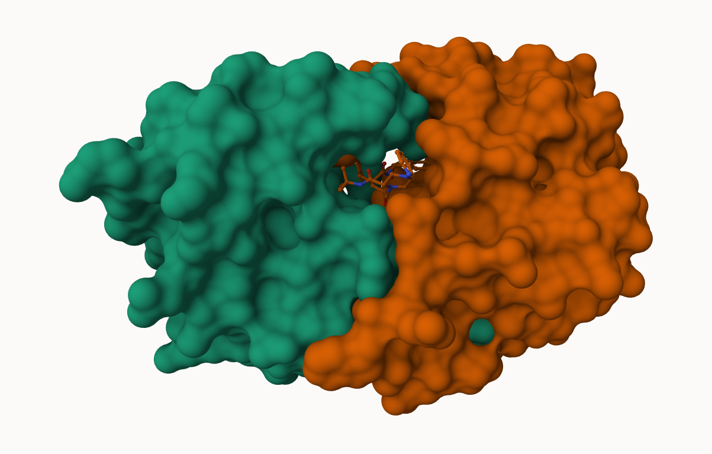
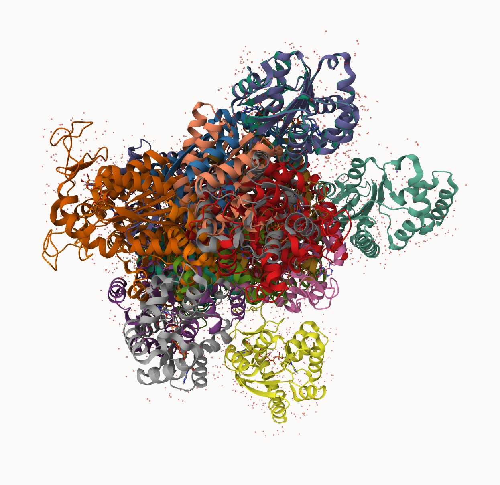

## 1. Introduction to the RCSB Protein Data Bank (PDB)

```{r}
library(dplyr)
library(tidyverse)
```


```{r}
pbd_data <- read.csv("pdb_stats.csv")
head(pbd_data)
```
The commas in these numbers leads to the numbers here being read as characters.

```{r}
library(readr)
pbd_data_2<-read_csv("pdb_stats.csv")
head(pbd_data_2)

xrayem<-sum(c(pbd_data_2$`X-ray`, pbd_data_2$`EM`))
xray<-sum(pbd_data_2$`X-ray`)
em<-sum(pbd_data_2$EM)
total<-sum(pbd_data_2$`Total`)
percentxray <- xray/total
percentem<-em/total
percentxrayem<-100*(xrayem/total)
percentxrayem
```


> Q1: What percentage of structures in the PDB are solved by X-Ray and Electron Microscopy.
      > ans: 93.8 for X-ray and EM total. 
      
```{r}
100*(proteinstructures<-pbd_data_2[1,9]/total)
```

> Q2: What proportion of structures in the PDB are protein?
      > ans: 85.96%
> Q3: Type HIV in the PDB website search box on the home page and determine how many HIV-1 protease structures are in the current PDB?
      > ans: 1,173

## 2. Visualizing the HIV-1 protease structure




> Q4: Water molecules normally have 3 atoms. Why do we see just one atom per water molecule in this structure?
      > ans: We see one atom because the other components of the molecule are more important and we can imply that the smaller, less relevant pieces labeled 'water' are just that, smaller and less relevant. 

> Q5: There is a critical “conserved” water molecule in the binding site. Can you identify this water molecule? What residue number does this water molecule have?
      > ans: 1608

>Q6: Generate and save a figure clearly showing the two distinct chains of HIV-protease along with the ligand. You might also consider showing the catalytic residues ASP 25 in each chain and the critical water (we recommend “Ball & Stick” for these side-chains). Add this figure to your Quarto document.
      > ans: in the quarto

## Bio3D Package for Structural Bioinformatics

```{r}
library(bio3d)

pdb <- read.pdb("1hsg")
pdb

##MK1 is the ligand
```
```{r}
head(pdb$atom)
```

```{r}
library(bio3dview)
library(NGLVieweR)

#view.pdb(pdb)

#view.pdb(pdb) |>
  #setSpin()

#sele <- atom.select(pdb, resno=25)

# and highlight them in spacefill representation

  #view.pdb(pdb, cols=c("navy","teal"), 
         #highlight = sele,
         #highlight.style = "spacefill") |>
  #setRock()
```

> Q7: How many amino acid residues are there in this pdb object? 
        > ans: 198
> Q8: Name one of the two non-protein residues? 
        > ans: HOH
> Q9: How many protein chains are in this structure? 
        > ans: 2
        
# Predicting functional motions of a single structure

```{r}
adk <- read.pdb("6s36")
adk

# Perform flexiblity prediction
m <- nma(adk)
plot(m)
```

```{r}
#mktrj(m, file="adk_m7.pdb")
```


```{r}
#view.nma(m, pdb=adk)
```

## Feb 10th...resume...

## 5. Comparative analysis with PCA

First step: fins ADK sequence

```{r}
library(bio3d)
id<- "1ake_A" ##change this to run a different analysis
aa <-get.seq( id )
aa
```

Next step is search the PDB database for all related entries...using BLAST...


ALL BLAST RESULTS
```{r}
blast <- blast.pdb(aa)
hits<-plot(blast)
```
TOP HITS

```{r}
head(blast$hit.tbl)
```

The 'top hits' are the `hits` object. Now we can download these to our computer. Put these in a wee sub-folder (directory) called "pdbs" and use gzip to speed things up.

```{r}
files <- get.pdb(hits$pdb.id, path="pdbs", split=TRUE, gzip=TRUE)
```



## Align and superpose structures

This requires the BioConductor package...

```{r}
library(BiocManager)
```


```{r}
# Align releated PDBs
pdbs <- pdbaln(files, fit = TRUE, exefile="msa")
```

```{r}
BiocManager::install("msa")
```
```{r}
pdbs
```

We could view these in R with *bio3dview** `view.pdbs()` function. 

```{r}
library(bio3dview)
view.pdbs(pdbs, colorScheme = "residue")
```

We can run PCA on our `pdbs` object and use the `pca()` function.

```{r}
pc.xray <- pca(pdbs)
plot(pc.xray)
```

```{r}
plot(pc.xray, 1:2)
```

We can make a visualization of the major conformational difference (i.e. large scale structure change) captured by our PCA analysis with the `mktrj()` function. 

```{r}
# Visualize first principal component
pc1 <- mktrj(pc.xray, pc=1, file="pc_1.pdb")
pc1
```

