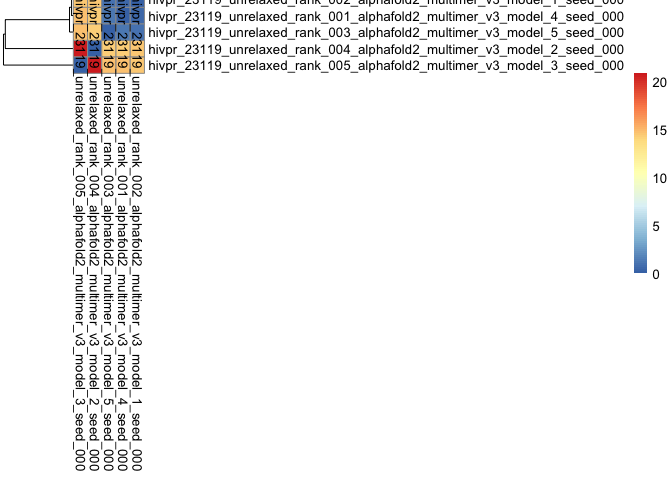
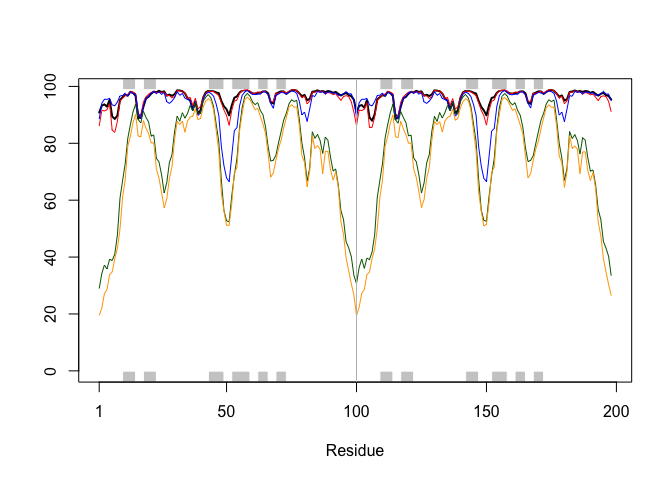
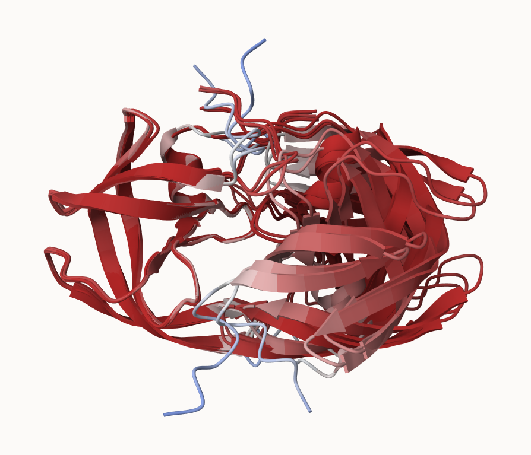
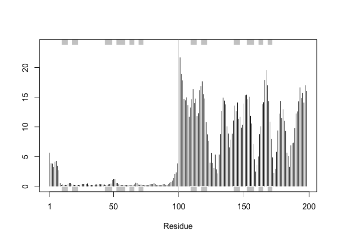
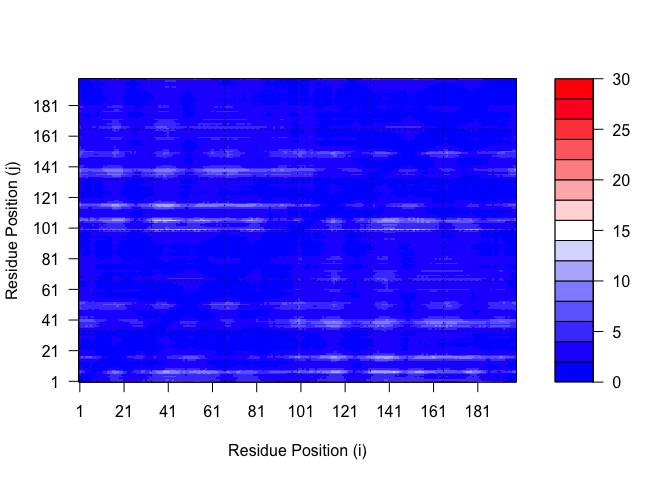
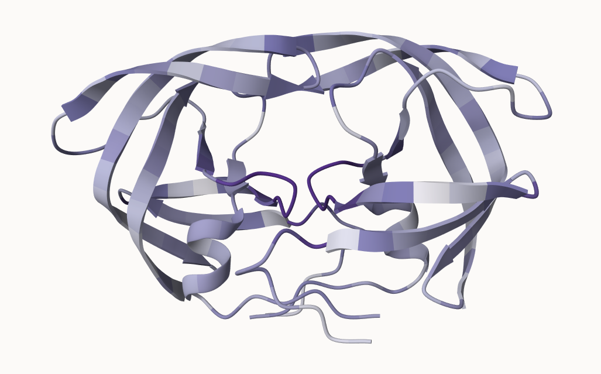

# bimm143_lab11
Malibu Slattery (A18488012)

- [1. Overview](#1-overview)
- [5. The EBI AlphaFold database](#5-the-ebi-alphafold-database)
- [Running Alphafold
  https://github.com/sokrypton/ColabFold](#running-alphafold-httpsgithubcomsokryptoncolabfold)
- [8. Custom analysis of resulting
  models](#8-custom-analysis-of-resulting-models)
- [Predicted Alignment Error for
  domains](#predicted-alignment-error-for-domains)
- [Residue conservation from alignment
  file](#residue-conservation-from-alignment-file)

## 1. Overview

We saw last day that the main repository molecular structure (the PDB
database) only has ~250,000 entries. UniProtKB (the main protein
sequence database) has over 200 million entries. \#Regions that are off
the diagonal of the contact map are important

In this hands-on session we will utilize AlphaFold to predict protein
structure from sequence (Jumper et al. 2021). Without the aid of such
approaches, it can take years of expensive laboratory work to determine
the structure of just one protein. With AlphaFold we can now accurately
compute a typical protein structure in as little as ten minutes.

## 5. The EBI AlphaFold database

The EBI AlphaFold database contains lots of computed structure models.
It is increasingly likely that the structure you are interested in is
already in this database. https://alphafold.ebi.ac.uk/

There are 3 major outputs from alphafold.

1.  model of structure in **pdb** format
2.  a **pLDDT score**: tells us how confident the model is for a given
    residue in your protein (high values are good, above 70)
3.  a **PAE score** that tells us about protein packing quality

If you can’t find a matching entry for a sequence you are interested in
AFDB, you can run Alphafold yourselves…

## Running Alphafold https://github.com/sokrypton/ColabFold

We will use CollabFold to run Alphafold:
https://colab.research.google.com/github/sokrypton/ColabFold/blob/main/AlphaFold2.ipynb

## 8. Custom analysis of resulting models

Figure from alphafold here….

``` r
results_dir <- "hivpr_23119" 

# File names for all PDB models
pdb_files <- list.files(path=results_dir,
                        pattern="*.pdb",
                        full.names = TRUE)

# Print our PDB file names
basename(pdb_files)
```

    [1] "hivpr_23119_unrelaxed_rank_001_alphafold2_multimer_v3_model_4_seed_000.pdb"
    [2] "hivpr_23119_unrelaxed_rank_002_alphafold2_multimer_v3_model_1_seed_000.pdb"
    [3] "hivpr_23119_unrelaxed_rank_003_alphafold2_multimer_v3_model_5_seed_000.pdb"
    [4] "hivpr_23119_unrelaxed_rank_004_alphafold2_multimer_v3_model_2_seed_000.pdb"
    [5] "hivpr_23119_unrelaxed_rank_005_alphafold2_multimer_v3_model_3_seed_000.pdb"

``` r
library(bio3d)
pdb_files <- list.files("hivpr_23119", pattern = ".pdb", full.names= T)

pdbs <- pdbaln(pdb_files, fit = TRUE, exefile="msa")
```

    Reading PDB files:
    hivpr_23119/hivpr_23119_unrelaxed_rank_001_alphafold2_multimer_v3_model_4_seed_000.pdb
    hivpr_23119/hivpr_23119_unrelaxed_rank_002_alphafold2_multimer_v3_model_1_seed_000.pdb
    hivpr_23119/hivpr_23119_unrelaxed_rank_003_alphafold2_multimer_v3_model_5_seed_000.pdb
    hivpr_23119/hivpr_23119_unrelaxed_rank_004_alphafold2_multimer_v3_model_2_seed_000.pdb
    hivpr_23119/hivpr_23119_unrelaxed_rank_005_alphafold2_multimer_v3_model_3_seed_000.pdb
    .....

    Extracting sequences

    pdb/seq: 1   name: hivpr_23119/hivpr_23119_unrelaxed_rank_001_alphafold2_multimer_v3_model_4_seed_000.pdb 
    pdb/seq: 2   name: hivpr_23119/hivpr_23119_unrelaxed_rank_002_alphafold2_multimer_v3_model_1_seed_000.pdb 
    pdb/seq: 3   name: hivpr_23119/hivpr_23119_unrelaxed_rank_003_alphafold2_multimer_v3_model_5_seed_000.pdb 
    pdb/seq: 4   name: hivpr_23119/hivpr_23119_unrelaxed_rank_004_alphafold2_multimer_v3_model_2_seed_000.pdb 
    pdb/seq: 5   name: hivpr_23119/hivpr_23119_unrelaxed_rank_005_alphafold2_multimer_v3_model_3_seed_000.pdb 

``` r
basename(pdb_files)
```

    [1] "hivpr_23119_unrelaxed_rank_001_alphafold2_multimer_v3_model_4_seed_000.pdb"
    [2] "hivpr_23119_unrelaxed_rank_002_alphafold2_multimer_v3_model_1_seed_000.pdb"
    [3] "hivpr_23119_unrelaxed_rank_003_alphafold2_multimer_v3_model_5_seed_000.pdb"
    [4] "hivpr_23119_unrelaxed_rank_004_alphafold2_multimer_v3_model_2_seed_000.pdb"
    [5] "hivpr_23119_unrelaxed_rank_005_alphafold2_multimer_v3_model_3_seed_000.pdb"

``` r
#library(bio3dview)
#view.pdbs(pdbs)
```

How similar or different are my models?

``` r
rd<-rmsd(pdbs)
```

    Warning in rmsd(pdbs): No indices provided, using the 198 non NA positions

``` r
range(rd)
```

    [1]  0.000 20.869

``` r
library(pheatmap)
pheatmap(rd)
```



``` r
colnames(rd) <- paste0("m",1:5)
rownames(rd) <- paste0("m",1:5)
pheatmap(rd)
```


Now lets plot the pLDDT values across all models. Recall that this
information is in the B-factor column of each model and that this is
stored in our aligned pdbs object as pdbs\$b with a row per
structure/model.

``` r
# Read a reference PDB structure
pdb <- read.pdb("1hsg")
```

      Note: Accessing on-line PDB file

``` r
plotb3(pdbs$b[1,], typ="l", lwd=2, sse=pdb)
points(pdbs$b[2,], typ="l", col="red")
points(pdbs$b[3,], typ="l", col="blue")
points(pdbs$b[4,], typ="l", col="darkgreen")
points(pdbs$b[5,], typ="l", col="orange")
abline(v=100, col="gray")
```



``` r
core <- core.find(pdbs)
```

     core size 197 of 198  vol = 9885.822 
     core size 196 of 198  vol = 6896.71 
     core size 195 of 198  vol = 1337.847 
     core size 194 of 198  vol = 1040.67 
     core size 193 of 198  vol = 951.857 
     core size 192 of 198  vol = 899.083 
     core size 191 of 198  vol = 834.732 
     core size 190 of 198  vol = 771.338 
     core size 189 of 198  vol = 733.065 
     core size 188 of 198  vol = 697.28 
     core size 187 of 198  vol = 659.742 
     core size 186 of 198  vol = 625.273 
     core size 185 of 198  vol = 589.541 
     core size 184 of 198  vol = 568.253 
     core size 183 of 198  vol = 545.015 
     core size 182 of 198  vol = 512.889 
     core size 181 of 198  vol = 490.723 
     core size 180 of 198  vol = 470.266 
     core size 179 of 198  vol = 450.731 
     core size 178 of 198  vol = 434.735 
     core size 177 of 198  vol = 420.337 
     core size 176 of 198  vol = 406.658 
     core size 175 of 198  vol = 393.334 
     core size 174 of 198  vol = 382.395 
     core size 173 of 198  vol = 372.858 
     core size 172 of 198  vol = 356.994 
     core size 171 of 198  vol = 346.567 
     core size 170 of 198  vol = 337.446 
     core size 169 of 198  vol = 326.659 
     core size 168 of 198  vol = 314.95 
     core size 167 of 198  vol = 304.127 
     core size 166 of 198  vol = 294.552 
     core size 165 of 198  vol = 285.648 
     core size 164 of 198  vol = 278.884 
     core size 163 of 198  vol = 266.765 
     core size 162 of 198  vol = 258.994 
     core size 161 of 198  vol = 247.723 
     core size 160 of 198  vol = 239.84 
     core size 159 of 198  vol = 234.963 
     core size 158 of 198  vol = 230.062 
     core size 157 of 198  vol = 221.985 
     core size 156 of 198  vol = 215.62 
     core size 155 of 198  vol = 206.793 
     core size 154 of 198  vol = 196.984 
     core size 153 of 198  vol = 188.539 
     core size 152 of 198  vol = 182.262 
     core size 151 of 198  vol = 176.954 
     core size 150 of 198  vol = 170.712 
     core size 149 of 198  vol = 166.119 
     core size 148 of 198  vol = 159.796 
     core size 147 of 198  vol = 153.767 
     core size 146 of 198  vol = 149.092 
     core size 145 of 198  vol = 143.657 
     core size 144 of 198  vol = 137.138 
     core size 143 of 198  vol = 132.517 
     core size 142 of 198  vol = 127.231 
     core size 141 of 198  vol = 121.574 
     core size 140 of 198  vol = 116.775 
     core size 139 of 198  vol = 112.57 
     core size 138 of 198  vol = 108.17 
     core size 137 of 198  vol = 105.133 
     core size 136 of 198  vol = 101.249 
     core size 135 of 198  vol = 97.374 
     core size 134 of 198  vol = 92.974 
     core size 133 of 198  vol = 88.184 
     core size 132 of 198  vol = 84.029 
     core size 131 of 198  vol = 81.898 
     core size 130 of 198  vol = 78.019 
     core size 129 of 198  vol = 75.272 
     core size 128 of 198  vol = 73.052 
     core size 127 of 198  vol = 70.695 
     core size 126 of 198  vol = 68.975 
     core size 125 of 198  vol = 66.694 
     core size 124 of 198  vol = 64.394 
     core size 123 of 198  vol = 62.092 
     core size 122 of 198  vol = 59.045 
     core size 121 of 198  vol = 56.629 
     core size 120 of 198  vol = 54.016 
     core size 119 of 198  vol = 51.806 
     core size 118 of 198  vol = 49.652 
     core size 117 of 198  vol = 48.193 
     core size 116 of 198  vol = 46.648 
     core size 115 of 198  vol = 44.752 
     core size 114 of 198  vol = 43.292 
     core size 113 of 198  vol = 41.093 
     core size 112 of 198  vol = 39.147 
     core size 111 of 198  vol = 36.472 
     core size 110 of 198  vol = 34.117 
     core size 109 of 198  vol = 31.47 
     core size 108 of 198  vol = 29.448 
     core size 107 of 198  vol = 27.325 
     core size 106 of 198  vol = 25.822 
     core size 105 of 198  vol = 24.15 
     core size 104 of 198  vol = 22.648 
     core size 103 of 198  vol = 21.069 
     core size 102 of 198  vol = 19.953 
     core size 101 of 198  vol = 18.3 
     core size 100 of 198  vol = 15.723 
     core size 99 of 198  vol = 14.841 
     core size 98 of 198  vol = 11.646 
     core size 97 of 198  vol = 9.434 
     core size 96 of 198  vol = 7.354 
     core size 95 of 198  vol = 6.179 
     core size 94 of 198  vol = 5.666 
     core size 93 of 198  vol = 4.705 
     core size 92 of 198  vol = 3.665 
     core size 91 of 198  vol = 2.77 
     core size 90 of 198  vol = 2.151 
     core size 89 of 198  vol = 1.715 
     core size 88 of 198  vol = 1.15 
     core size 87 of 198  vol = 0.874 
     core size 86 of 198  vol = 0.685 
     core size 85 of 198  vol = 0.528 
     core size 84 of 198  vol = 0.37 
     FINISHED: Min vol ( 0.5 ) reached

``` r
core.inds <- print(core, vol=0.5)
```

    # 85 positions (cumulative volume <= 0.5 Angstrom^3) 
      start end length
    1     9  49     41
    2    52  95     44

``` r
library(dplyr)
```


    Attaching package: 'dplyr'

    The following objects are masked from 'package:stats':

        filter, lag

    The following objects are masked from 'package:base':

        intersect, setdiff, setequal, union

``` r
library(tidyverse)
```

    ── Attaching core tidyverse packages ──────────────────────── tidyverse 2.0.0 ──
    ✔ forcats   1.0.1     ✔ readr     2.2.0
    ✔ ggplot2   4.0.2     ✔ stringr   1.6.0
    ✔ lubridate 1.9.5     ✔ tibble    3.3.1
    ✔ purrr     1.2.1     ✔ tidyr     1.3.2

    ── Conflicts ────────────────────────────────────────── tidyverse_conflicts() ──
    ✖ dplyr::filter() masks stats::filter()
    ✖ dplyr::lag()    masks stats::lag()
    ℹ Use the conflicted package (<http://conflicted.r-lib.org/>) to force all conflicts to become errors

``` r
library(readr)
```

``` r
core <- core.find(pdbs)
```

     core size 197 of 198  vol = 9885.822 
     core size 196 of 198  vol = 6896.71 
     core size 195 of 198  vol = 1337.847 
     core size 194 of 198  vol = 1040.67 
     core size 193 of 198  vol = 951.857 
     core size 192 of 198  vol = 899.083 
     core size 191 of 198  vol = 834.732 
     core size 190 of 198  vol = 771.338 
     core size 189 of 198  vol = 733.065 
     core size 188 of 198  vol = 697.28 
     core size 187 of 198  vol = 659.742 
     core size 186 of 198  vol = 625.273 
     core size 185 of 198  vol = 589.541 
     core size 184 of 198  vol = 568.253 
     core size 183 of 198  vol = 545.015 
     core size 182 of 198  vol = 512.889 
     core size 181 of 198  vol = 490.723 
     core size 180 of 198  vol = 470.266 
     core size 179 of 198  vol = 450.731 
     core size 178 of 198  vol = 434.735 
     core size 177 of 198  vol = 420.337 
     core size 176 of 198  vol = 406.658 
     core size 175 of 198  vol = 393.334 
     core size 174 of 198  vol = 382.395 
     core size 173 of 198  vol = 372.858 
     core size 172 of 198  vol = 356.994 
     core size 171 of 198  vol = 346.567 
     core size 170 of 198  vol = 337.446 
     core size 169 of 198  vol = 326.659 
     core size 168 of 198  vol = 314.95 
     core size 167 of 198  vol = 304.127 
     core size 166 of 198  vol = 294.552 
     core size 165 of 198  vol = 285.648 
     core size 164 of 198  vol = 278.884 
     core size 163 of 198  vol = 266.765 
     core size 162 of 198  vol = 258.994 
     core size 161 of 198  vol = 247.723 
     core size 160 of 198  vol = 239.84 
     core size 159 of 198  vol = 234.963 
     core size 158 of 198  vol = 230.062 
     core size 157 of 198  vol = 221.985 
     core size 156 of 198  vol = 215.62 
     core size 155 of 198  vol = 206.793 
     core size 154 of 198  vol = 196.984 
     core size 153 of 198  vol = 188.539 
     core size 152 of 198  vol = 182.262 
     core size 151 of 198  vol = 176.954 
     core size 150 of 198  vol = 170.712 
     core size 149 of 198  vol = 166.119 
     core size 148 of 198  vol = 159.796 
     core size 147 of 198  vol = 153.767 
     core size 146 of 198  vol = 149.092 
     core size 145 of 198  vol = 143.657 
     core size 144 of 198  vol = 137.138 
     core size 143 of 198  vol = 132.517 
     core size 142 of 198  vol = 127.231 
     core size 141 of 198  vol = 121.574 
     core size 140 of 198  vol = 116.775 
     core size 139 of 198  vol = 112.57 
     core size 138 of 198  vol = 108.17 
     core size 137 of 198  vol = 105.133 
     core size 136 of 198  vol = 101.249 
     core size 135 of 198  vol = 97.374 
     core size 134 of 198  vol = 92.974 
     core size 133 of 198  vol = 88.184 
     core size 132 of 198  vol = 84.029 
     core size 131 of 198  vol = 81.898 
     core size 130 of 198  vol = 78.019 
     core size 129 of 198  vol = 75.272 
     core size 128 of 198  vol = 73.052 
     core size 127 of 198  vol = 70.695 
     core size 126 of 198  vol = 68.975 
     core size 125 of 198  vol = 66.694 
     core size 124 of 198  vol = 64.394 
     core size 123 of 198  vol = 62.092 
     core size 122 of 198  vol = 59.045 
     core size 121 of 198  vol = 56.629 
     core size 120 of 198  vol = 54.016 
     core size 119 of 198  vol = 51.806 
     core size 118 of 198  vol = 49.652 
     core size 117 of 198  vol = 48.193 
     core size 116 of 198  vol = 46.648 
     core size 115 of 198  vol = 44.752 
     core size 114 of 198  vol = 43.292 
     core size 113 of 198  vol = 41.093 
     core size 112 of 198  vol = 39.147 
     core size 111 of 198  vol = 36.472 
     core size 110 of 198  vol = 34.117 
     core size 109 of 198  vol = 31.47 
     core size 108 of 198  vol = 29.448 
     core size 107 of 198  vol = 27.325 
     core size 106 of 198  vol = 25.822 
     core size 105 of 198  vol = 24.15 
     core size 104 of 198  vol = 22.648 
     core size 103 of 198  vol = 21.069 
     core size 102 of 198  vol = 19.953 
     core size 101 of 198  vol = 18.3 
     core size 100 of 198  vol = 15.723 
     core size 99 of 198  vol = 14.841 
     core size 98 of 198  vol = 11.646 
     core size 97 of 198  vol = 9.434 
     core size 96 of 198  vol = 7.354 
     core size 95 of 198  vol = 6.179 
     core size 94 of 198  vol = 5.666 
     core size 93 of 198  vol = 4.705 
     core size 92 of 198  vol = 3.665 
     core size 91 of 198  vol = 2.77 
     core size 90 of 198  vol = 2.151 
     core size 89 of 198  vol = 1.715 
     core size 88 of 198  vol = 1.15 
     core size 87 of 198  vol = 0.874 
     core size 86 of 198  vol = 0.685 
     core size 85 of 198  vol = 0.528 
     core size 84 of 198  vol = 0.37 
     FINISHED: Min vol ( 0.5 ) reached

``` r
head(core)
```

    $volume
      [1] 9885.8222088 6896.7104785 1337.8466872 1040.6703025  951.8567422
      [6]  899.0827060  834.7318094  771.3382788  733.0646526  697.2799829
     [11]  659.7419258  625.2730885  589.5407255  568.2533542  545.0149075
     [16]  512.8892015  490.7232967  470.2661655  450.7307084  434.7350579
     [21]  420.3370059  406.6584540  393.3336894  382.3947249  372.8583674
     [26]  356.9935092  346.5673626  337.4459933  326.6587410  314.9498167
     [31]  304.1274343  294.5523842  285.6482398  278.8842031  266.7649181
     [36]  258.9944305  247.7225901  239.8402423  234.9629813  230.0617218
     [41]  221.9848603  215.6203651  206.7926108  196.9841447  188.5393231
     [46]  182.2620849  176.9535102  170.7115518  166.1194954  159.7964858
     [51]  153.7665658  149.0922214  143.6572666  137.1380719  132.5170266
     [56]  127.2311912  121.5738955  116.7747803  112.5699383  108.1697877
     [61]  105.1330888  101.2493848   97.3744330   92.9740123   88.1837479
     [66]   84.0287881   81.8980979   78.0188809   75.2720206   73.0523227
     [71]   70.6950564   68.9753184   66.6942259   64.3939590   62.0917280
     [76]   59.0447400   56.6290963   54.0158493   51.8055970   49.6520500
     [81]   48.1927838   46.6477535   44.7516594   43.2917289   41.0930694
     [86]   39.1466258   36.4715494   34.1169926   31.4702050   29.4475540
     [91]   27.3248862   25.8222185   24.1504738   22.6484510   21.0693776
     [96]   19.9530252   18.3000882   15.7229786   14.8407337   11.6457513
    [101]    9.4343285    7.3537788    6.1792434    5.6655976    4.7053620
    [106]    3.6647737    2.7701942    2.1510228    1.7149668    1.1502153
    [111]    0.8738957    0.6847490    0.5278354    0.3698715           NA
    [116]           NA           NA           NA           NA           NA
    [121]           NA           NA           NA           NA           NA
    [126]           NA           NA           NA           NA           NA
    [131]           NA           NA           NA           NA           NA
    [136]           NA           NA           NA           NA           NA
    [141]           NA           NA           NA           NA           NA
    [146]           NA           NA           NA           NA           NA
    [151]           NA           NA           NA           NA           NA
    [156]           NA           NA           NA           NA           NA
    [161]           NA           NA           NA           NA           NA
    [166]           NA           NA           NA           NA           NA
    [171]           NA           NA           NA           NA           NA
    [176]           NA           NA           NA           NA           NA
    [181]           NA           NA           NA           NA           NA
    [186]           NA           NA           NA           NA           NA
    [191]           NA           NA           NA           NA           NA
    [196]           NA           NA           NA

    $length
      [1] 197 196 195 194 193 192 191 190 189 188 187 186 185 184 183 182 181 180
     [19] 179 178 177 176 175 174 173 172 171 170 169 168 167 166 165 164 163 162
     [37] 161 160 159 158 157 156 155 154 153 152 151 150 149 148 147 146 145 144
     [55] 143 142 141 140 139 138 137 136 135 134 133 132 131 130 129 128 127 126
     [73] 125 124 123 122 121 120 119 118 117 116 115 114 113 112 111 110 109 108
     [91] 107 106 105 104 103 102 101 100  99  98  97  96  95  94  93  92  91  90
    [109]  89  88  87  86  85  84  NA  NA  NA  NA  NA  NA  NA  NA  NA  NA  NA  NA
    [127]  NA  NA  NA  NA  NA  NA  NA  NA  NA  NA  NA  NA  NA  NA  NA  NA  NA  NA
    [145]  NA  NA  NA  NA  NA  NA  NA  NA  NA  NA  NA  NA  NA  NA  NA  NA  NA  NA
    [163]  NA  NA  NA  NA  NA  NA  NA  NA  NA  NA  NA  NA  NA  NA  NA  NA  NA  NA
    [181]  NA  NA  NA  NA  NA  NA  NA  NA  NA  NA  NA  NA  NA  NA  NA  NA  NA  NA

    $resno
      [1] 53 51 52  1 46  3  2 54 55 48 45 47 44 49  7 50 56 43 79 57 35 78 36 37  6
     [26] 81 42 34 58 80 18 77 41  4 19 68 17 38 39 20 76  5 98 67 14 16 15 40 33 82
     [51] 59  6 99 32 21 12 13 29  8 83 65 91  3  2  1  7 51 88 30 28 75 23 74 60 92
     [76]  9 27 10 87 22 11 66 84 70 64 69 63 93 71 72 90 89 95 73 62  5 94 61 96 26
    [101] 86 99  4 31 24 97 85 98 25 97 96  8 50 49  9 10 11 12 13 14 15 16 17 18 19
    [126] 20 21 22 23 24 25 26 27 28 29 30 31 32 33 34 35 36 37 38 39 40 41 42 43 44
    [151] 45 46 47 48 52 53 54 55 56 57 58 59 60 61 62 63 64 65 66 67 68 69 70 71 72
    [176] 73 74 75 76 77 78 79 80 81 82 83 84 85 86 87 88 89 90 91 92 93 94 95

    $step.inds
      [1] 152 150 151 100 145 102 101 153 154 147 144 146 143 148 106 149 155 142
     [19] 178 156 134 177 135 136 105 180 141 133 157 179 117 176 140 103 118 167
     [37] 116 137 138 119 175 104 197 166 113 115 114 139 132 181 158   6 198 131
     [55] 120 111 112 128 107 182 164 190   3   2   1   7  51 187 129 127 174 122
     [73] 173 159 191 108 126 109 186 121 110 165 183 169 163 168 162 192 170 171
     [91] 189 188 194 172 161   5 193 160 195 125 185  99   4 130 123 196 184  98
    [109] 124  97  96   8  50  49   9  10  11  12  13  14  15  16  17  18  19  20
    [127]  21  22  23  24  25  26  27  28  29  30  31  32  33  34  35  36  37  38
    [145]  39  40  41  42  43  44  45  46  47  48  52  53  54  55  56  57  58  59
    [163]  60  61  62  63  64  65  66  67  68  69  70  71  72  73  74  75  76  77
    [181]  78  79  80  81  82  83  84  85  86  87  88  89  90  91  92  93  94  95

    $atom
     [1]  9 10 11 12 13 14 15 16 17 18 19 20 21 22 23 24 25 26 27 28 29 30 31 32 33
    [26] 34 35 36 37 38 39 40 41 42 43 44 45 46 47 48 49 52 53 54 55 56 57 58 59 60
    [51] 61 62 63 64 65 66 67 68 69 70 71 72 73 74 75 76 77 78 79 80 81 82 83 84 85
    [76] 86 87 88 89 90 91 92 93 94 95

    $xyz
      [1]  25  26  27  28  29  30  31  32  33  34  35  36  37  38  39  40  41  42
     [19]  43  44  45  46  47  48  49  50  51  52  53  54  55  56  57  58  59  60
     [37]  61  62  63  64  65  66  67  68  69  70  71  72  73  74  75  76  77  78
     [55]  79  80  81  82  83  84  85  86  87  88  89  90  91  92  93  94  95  96
     [73]  97  98  99 100 101 102 103 104 105 106 107 108 109 110 111 112 113 114
     [91] 115 116 117 118 119 120 121 122 123 124 125 126 127 128 129 130 131 132
    [109] 133 134 135 136 137 138 139 140 141 142 143 144 145 146 147 154 155 156
    [127] 157 158 159 160 161 162 163 164 165 166 167 168 169 170 171 172 173 174
    [145] 175 176 177 178 179 180 181 182 183 184 185 186 187 188 189 190 191 192
    [163] 193 194 195 196 197 198 199 200 201 202 203 204 205 206 207 208 209 210
    [181] 211 212 213 214 215 216 217 218 219 220 221 222 223 224 225 226 227 228
    [199] 229 230 231 232 233 234 235 236 237 238 239 240 241 242 243 244 245 246
    [217] 247 248 249 250 251 252 253 254 255 256 257 258 259 260 261 262 263 264
    [235] 265 266 267 268 269 270 271 272 273 274 275 276 277 278 279 280 281 282
    [253] 283 284 285

``` r
core.inds <- print(core, vol=0.5)
```

    # 85 positions (cumulative volume <= 0.5 Angstrom^3) 
      start end length
    1     9  49     41
    2    52  95     44

``` r
xyz <- pdbfit(pdbs, core.inds, outpath="corefit_structures")
```



``` r
rf <- rmsf(xyz)

plotb3(rf, sse=pdb)
abline(v=100, col="gray", ylab="RMSF")
```



## Predicted Alignment Error for domains

``` r
library(jsonlite)
```


    Attaching package: 'jsonlite'

    The following object is masked from 'package:purrr':

        flatten

``` r
# Listing of all PAE JSON files
pae_files <- list.files(path=results_dir,
                        pattern=".*model.*\\.json",
                        full.names = TRUE)
```

``` r
pae1 <- read_json(pae_files[1],simplifyVector = TRUE)
pae5 <- read_json(pae_files[5],simplifyVector = TRUE)

attributes(pae1)
```

    $names
    [1] "plddt"   "max_pae" "pae"     "ptm"     "iptm"   

``` r
# Per-residue pLDDT scores 
#  same as B-factor of PDB..
head(pae1$plddt) 
```

    [1] 90.81 93.25 93.69 92.88 95.25 89.44

``` r
pae1$max_pae
```

    [1] 12.84375

``` r
pae5$max_pae
```

    [1] 29.59375

``` r
plot.dmat(pae1$pae, 
          xlab="Residue Position (i)",
          ylab="Residue Position (j)")
```


``` r
plot.dmat(pae5$pae, 
          xlab="Residue Position (i)",
          ylab="Residue Position (j)",
          grid.col = "black",
          zlim=c(0,30))
```


``` r
plot.dmat(pae1$pae, 
          xlab="Residue Position (i)",
          ylab="Residue Position (j)",
          grid.col = "black",
          zlim=c(0,30))
```



## Residue conservation from alignment file

``` r
aln_file <- list.files(path=results_dir,
                       pattern=".a3m$",
                        full.names = TRUE)
aln_file
```

    [1] "hivpr_23119/hivpr_23119.a3m"

``` r
aln <- read.fasta(aln_file[1], to.upper = TRUE)
```

    [1] " ** Duplicated sequence id's: 101 **"
    [2] " ** Duplicated sequence id's: 101 **"

``` r
dim(aln$ali)
```

    [1] 5397  132

``` r
sim <- conserv(aln)

plotb3(sim[1:99], sse=trim.pdb(pdb, chain="A"),
       ylab="Conservation Score")
```


``` r
con <- consensus(aln, cutoff = 0.9)
con$seq
```

      [1] "-" "-" "-" "-" "-" "-" "-" "-" "-" "-" "-" "-" "-" "-" "-" "-" "-" "-"
     [19] "-" "-" "-" "-" "-" "-" "D" "T" "G" "A" "-" "-" "-" "-" "-" "-" "-" "-"
     [37] "-" "-" "-" "-" "-" "-" "-" "-" "-" "-" "-" "-" "-" "-" "-" "-" "-" "-"
     [55] "-" "-" "-" "-" "-" "-" "-" "-" "-" "-" "-" "-" "-" "-" "-" "-" "-" "-"
     [73] "-" "-" "-" "-" "-" "-" "-" "-" "-" "-" "-" "-" "-" "-" "-" "-" "-" "-"
     [91] "-" "-" "-" "-" "-" "-" "-" "-" "-" "-" "-" "-" "-" "-" "-" "-" "-" "-"
    [109] "-" "-" "-" "-" "-" "-" "-" "-" "-" "-" "-" "-" "-" "-" "-" "-" "-" "-"
    [127] "-" "-" "-" "-" "-" "-"

``` r
m1.pdb <- read.pdb(pdb_files[1])
occ <- vec2resno(c(sim[1:99], sim[1:99]), m1.pdb$atom$resno)
write.pdb(m1.pdb, o=occ, file="m1_conserv.pdb")
```


