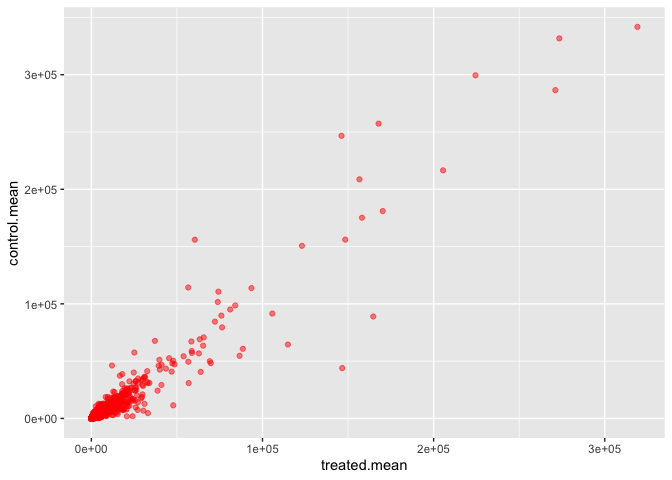
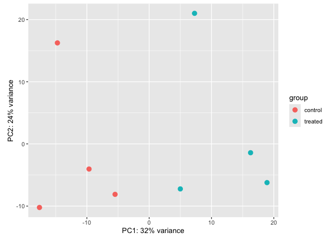
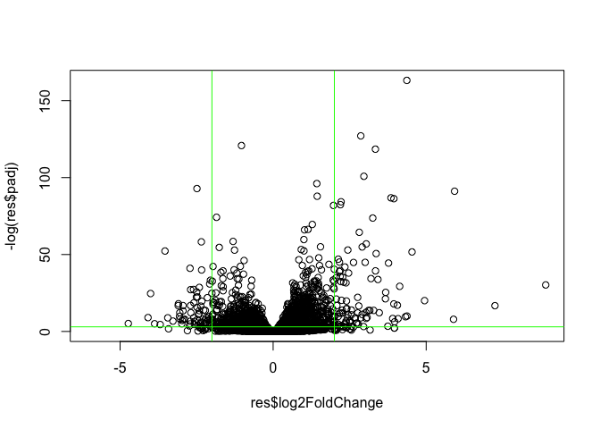
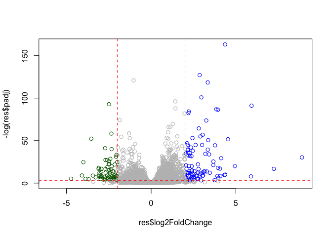
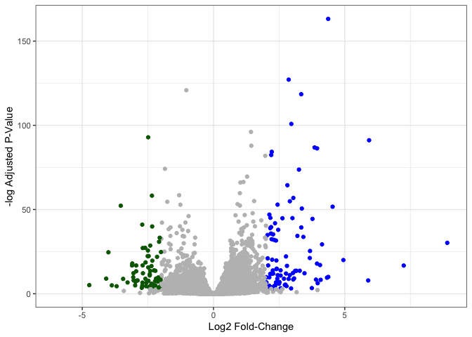

# class13
Malibu Slattery (A18488012)

- [Background](#background)
- [2. Bioconductor setup](#2-bioconductor-setup)
- [3. Import countData and colData](#3-import-countdata-and-coldata)
- [5. Setting up for DESeq](#5-setting-up-for-deseq)
- [6. Principal Component Analysis
  (PCA)](#6-principal-component-analysis-pca)
- [7. DESeq analysis](#7-deseq-analysis)
- [8. Adding annotation data](#8-adding-annotation-data)
  - [Adding some color annotation to the above
    plot](#adding-some-color-annotation-to-the-above-plot)
- [Save our results](#save-our-results)
- [Add annotation data](#add-annotation-data)
- [Pathway analysis](#pathway-analysis)

## Background

Today we will perform an RNASeq analysis of the effect of a common
steroid on airway cells. In particular, dexamethasone (“dex”) on
different airway smooth muscle cell lines (ASM cells).

## 2. Bioconductor setup

``` r
#install.packages("BiocManager")
#BiocManager::install()

#BiocManager::install("DESeq2")
```

``` r
library(BiocManager)
library(DESeq2)
```

    Loading required package: S4Vectors

    Loading required package: stats4

    Loading required package: BiocGenerics

    Loading required package: generics


    Attaching package: 'generics'

    The following objects are masked from 'package:base':

        as.difftime, as.factor, as.ordered, intersect, is.element, setdiff,
        setequal, union


    Attaching package: 'BiocGenerics'

    The following objects are masked from 'package:stats':

        IQR, mad, sd, var, xtabs

    The following objects are masked from 'package:base':

        anyDuplicated, aperm, append, as.data.frame, basename, cbind,
        colnames, dirname, do.call, duplicated, eval, evalq, Filter, Find,
        get, grep, grepl, is.unsorted, lapply, Map, mapply, match, mget,
        order, paste, pmax, pmax.int, pmin, pmin.int, Position, rank,
        rbind, Reduce, rownames, sapply, saveRDS, table, tapply, unique,
        unsplit, which.max, which.min


    Attaching package: 'S4Vectors'

    The following object is masked from 'package:utils':

        findMatches

    The following objects are masked from 'package:base':

        expand.grid, I, unname

    Loading required package: IRanges

    Loading required package: GenomicRanges

    Loading required package: Seqinfo

    Loading required package: SummarizedExperiment

    Loading required package: MatrixGenerics

    Loading required package: matrixStats


    Attaching package: 'MatrixGenerics'

    The following objects are masked from 'package:matrixStats':

        colAlls, colAnyNAs, colAnys, colAvgsPerRowSet, colCollapse,
        colCounts, colCummaxs, colCummins, colCumprods, colCumsums,
        colDiffs, colIQRDiffs, colIQRs, colLogSumExps, colMadDiffs,
        colMads, colMaxs, colMeans2, colMedians, colMins, colOrderStats,
        colProds, colQuantiles, colRanges, colRanks, colSdDiffs, colSds,
        colSums2, colTabulates, colVarDiffs, colVars, colWeightedMads,
        colWeightedMeans, colWeightedMedians, colWeightedSds,
        colWeightedVars, rowAlls, rowAnyNAs, rowAnys, rowAvgsPerColSet,
        rowCollapse, rowCounts, rowCummaxs, rowCummins, rowCumprods,
        rowCumsums, rowDiffs, rowIQRDiffs, rowIQRs, rowLogSumExps,
        rowMadDiffs, rowMads, rowMaxs, rowMeans2, rowMedians, rowMins,
        rowOrderStats, rowProds, rowQuantiles, rowRanges, rowRanks,
        rowSdDiffs, rowSds, rowSums2, rowTabulates, rowVarDiffs, rowVars,
        rowWeightedMads, rowWeightedMeans, rowWeightedMedians,
        rowWeightedSds, rowWeightedVars

    Loading required package: Biobase

    Welcome to Bioconductor

        Vignettes contain introductory material; view with
        'browseVignettes()'. To cite Bioconductor, see
        'citation("Biobase")', and for packages 'citation("pkgname")'.


    Attaching package: 'Biobase'

    The following object is masked from 'package:MatrixGenerics':

        rowMedians

    The following objects are masked from 'package:matrixStats':

        anyMissing, rowMedians

``` r
library(ggplot2)
```

## 3. Import countData and colData

- countData: with **genes** in rows and **experiments** in columns
- colData: metadata that describes the columns in count data

``` r
# Complete the missing code
counts <- read.csv("airway_scaledcounts.csv", row.names=1)
head(counts)
```

                    SRR1039508 SRR1039509 SRR1039512 SRR1039513 SRR1039516
    ENSG00000000003        723        486        904        445       1170
    ENSG00000000005          0          0          0          0          0
    ENSG00000000419        467        523        616        371        582
    ENSG00000000457        347        258        364        237        318
    ENSG00000000460         96         81         73         66        118
    ENSG00000000938          0          0          1          0          2
                    SRR1039517 SRR1039520 SRR1039521
    ENSG00000000003       1097        806        604
    ENSG00000000005          0          0          0
    ENSG00000000419        781        417        509
    ENSG00000000457        447        330        324
    ENSG00000000460         94        102         74
    ENSG00000000938          0          0          0

``` r
metadata <-  read.csv("airway_metadata.csv")
head(metadata)
```

              id     dex celltype     geo_id
    1 SRR1039508 control   N61311 GSM1275862
    2 SRR1039509 treated   N61311 GSM1275863
    3 SRR1039512 control  N052611 GSM1275866
    4 SRR1039513 treated  N052611 GSM1275867
    5 SRR1039516 control  N080611 GSM1275870
    6 SRR1039517 treated  N080611 GSM1275871

``` r
nrow(counts)
```

    [1] 38694

> Q1. How many genes are in this dataset? ans:38694 “SRR1039508” refers
> to a sample ID and “ENSG00000000003” is a gene ID

``` r
metadata$dex
```

    [1] "control" "treated" "control" "treated" "control" "treated" "control"
    [8] "treated"

``` r
table(metadata$dex)
```


    control treated 
          4       4 

``` r
sum(metadata$dex == "control")
```

    [1] 4

> Q2. How many ‘control’ cell lines do we have? ans: 4

\## 4. Toy differential gene expression

We have 4 replicate drug treated and control (no drug)
columns/experiments in our `counts` object. We want one “mean” value for
each gene (rows) in “treated” (drug) and one mean value for each gene in
“control” cols.

STEP 1. Find all “control” columns. STEP 2. Extract these columns to a
new object called “control.counts” STEP 3. Then calculate the mean value
for each gene.

> Q3. How would you make the above code in either approach more robust?
> Is there a function that could help here? ans: rowSums Q4. Follow the
> same procedure for the treated samples (i.e. calculate the mean per
> gene across drug treated samples and assign to a labeled vector called
> treated.mean) ans:

step 1…

``` r
control.inds <- metadata$dex == "control"
```

step 2…

``` r
control.counts<-counts[,control.inds]
```

step 3…

``` r
control.mean <- rowMeans(control.counts)
```

Now do the same thing for the treated…

step 1…identifying which columns are needed (treated)

``` r
treated.inds <- metadata$dex == "treated"
```

step 2…from the object (csv file called “counts”), we set the columns as
`treated.inds`.

``` r
treated.counts<-counts[,treated.inds]
```

step 3…

``` r
treated.mean <- rowMeans(treated.counts)
head(treated.mean)
```

    ENSG00000000003 ENSG00000000005 ENSG00000000419 ENSG00000000457 ENSG00000000460 
             658.00            0.00          546.00          316.50           78.75 
    ENSG00000000938 
               0.00 

> Q5a…

``` r
meancounts <- data.frame(control.mean, treated.mean)
plot(meancounts)
```


This is screaming for a log transform (when you have such highly skewed
data)!!

> Q6. Try plotting both axes on a log scale. What is the argument to
> plot() that allows you to do this? ans: log = “xy”

``` r
plot(meancounts, log="xy")
```

    Warning in xy.coords(x, y, xlabel, ylabel, log): 15032 x values <= 0 omitted
    from logarithmic plot

    Warning in xy.coords(x, y, xlabel, ylabel, log): 15281 y values <= 0 omitted
    from logarithmic plot


**N.B.** We most often use log2 for this type of data because it makes
the interpretation much more straightforward.

Treated/Control is often called “fold-change”…

If there was no change, we would have a log2-fc of 0

``` r
log2(10/10)
```

    [1] 0

If we had double the amount of transcription, we’d have a log2-fc of 1

``` r
log2(20/10)
```

    [1] 1

If we had half the amount of transcription, we’d have a log2-fc of -1

``` r
log2(5/10)
```

    [1] -1

> Q. Calculate a log2 fold change value for all our genes and add it as
> a new column to our `meancounts` object…

``` r
meancounts$log2fc <-log2(meancounts$treated.mean/meancounts$control.mean)

head(meancounts)
```

                    control.mean treated.mean      log2fc
    ENSG00000000003       900.75       658.00 -0.45303916
    ENSG00000000005         0.00         0.00         NaN
    ENSG00000000419       520.50       546.00  0.06900279
    ENSG00000000457       339.75       316.50 -0.10226805
    ENSG00000000460        97.25        78.75 -0.30441833
    ENSG00000000938         0.75         0.00        -Inf

> Q5(b).You could also use the ggplot2 package to make this figure
> producing the plot below. What geom\_?() function would you use for
> this plot? ans: geom_point()

``` r
library(ggplot2)
ggplot(meancounts, aes(treated.mean, control.mean)) + geom_point(color="red", alpha = .5)
```



There are some funky log2f cvalues (NaN and -Inf) here that come about
whenever we have 0 mean count values. Typically, we would remove these
genes from any further analysis–as we can’t say anything about them…

``` r
meancounts$log2fc <- log2(meancounts[,"treated.mean"]/meancounts[,"control.mean"])
head(meancounts)
```

                    control.mean treated.mean      log2fc
    ENSG00000000003       900.75       658.00 -0.45303916
    ENSG00000000005         0.00         0.00         NaN
    ENSG00000000419       520.50       546.00  0.06900279
    ENSG00000000457       339.75       316.50 -0.10226805
    ENSG00000000460        97.25        78.75 -0.30441833
    ENSG00000000938         0.75         0.00        -Inf

``` r
zero.vals <- which(meancounts[,1:2]==0, arr.ind=TRUE)

to.rm <- unique(zero.vals[,1])
mycounts <- meancounts[-to.rm,]
head(mycounts)
```

                    control.mean treated.mean      log2fc
    ENSG00000000003       900.75       658.00 -0.45303916
    ENSG00000000419       520.50       546.00  0.06900279
    ENSG00000000457       339.75       316.50 -0.10226805
    ENSG00000000460        97.25        78.75 -0.30441833
    ENSG00000000971      5219.00      6687.50  0.35769358
    ENSG00000001036      2327.00      1785.75 -0.38194109

> Q7. What is the purpose of the arr.ind argument in the which()
> function call above? Why would we then take the first column of the
> output and need to call the unique() function? the arr.ind function
> shows whether or not there are zero counts and unique filters those
> counts out if they are ‘0’ for both samples.

``` r
up.ind <- mycounts$log2fc > 2
sum(up.ind==TRUE)
```

    [1] 250

``` r
down.ind <- mycounts$log2fc < (-2)
sum(down.ind==TRUE)
```

    [1] 367

> Q 8. Using the up.ind vector above can you determine how many up
> regulated genes we have at the greater than 2 fc level? 250

> Q9. Using the down.ind vector above can you determine how many down
> regulated genes we have at the greater than 2 fc level? 367 Q10. Do
> you trust these results? Why or why not? I don’t trust these results a
> bunch because compared to the rest of the genes, there are relatively
> few up and down regulated genes above the 2fc level.

## 5. Setting up for DESeq

Let’s do this analysis with an estimate of statistical significance
using the DESeq2 package…

``` r
library(DESeq2)
```

DESeq2, like many Bioconductor packages, wants its input data in a *very
specific* way.

``` r
dds<-DESeqDataSetFromMatrix(countData=counts, 
                       colData=metadata, 
                       design = ~dex)
```

    converting counts to integer mode

    Warning in DESeqDataSet(se, design = design, ignoreRank): some variables in
    design formula are characters, converting to factors

## 6. Principal Component Analysis (PCA)

``` r
vsd <- vst(dds, blind = FALSE)
plotPCA(vsd, intgroup = c("dex"))
```

    using ntop=500 top features by variance



``` r
pcaData <- plotPCA(vsd, intgroup=c("dex"), returnData=TRUE)
```

    using ntop=500 top features by variance

``` r
head(pcaData)
```

                      PC1        PC2   group       name         id     dex celltype
    SRR1039508 -17.607922 -10.225252 control SRR1039508 SRR1039508 control   N61311
    SRR1039509   4.996738  -7.238117 treated SRR1039509 SRR1039509 treated   N61311
    SRR1039512  -5.474456  -8.113993 control SRR1039512 SRR1039512 control  N052611
    SRR1039513  18.912974  -6.226041 treated SRR1039513 SRR1039513 treated  N052611
    SRR1039516 -14.729173  16.252000 control SRR1039516 SRR1039516 control  N080611
    SRR1039517   7.279863  21.008034 treated SRR1039517 SRR1039517 treated  N080611
                   geo_id sizeFactor
    SRR1039508 GSM1275862  1.0193796
    SRR1039509 GSM1275863  0.9005653
    SRR1039512 GSM1275866  1.1784239
    SRR1039513 GSM1275867  0.6709854
    SRR1039516 GSM1275870  1.1731984
    SRR1039517 GSM1275871  1.3929361

``` r
# Calculate percent variance per PC for the plot axis labels
percentVar <- round(100 * attr(pcaData, "percentVar"))
```

``` r
library(ggplot2)
```

``` r
ggplot(pcaData) +
  aes(x = PC1, y = PC2, color = dex) +
  geom_point(size =3) +
  xlab(paste0("PC1: ", percentVar[1], "% variance")) +
  ylab(paste0("PC2: ", percentVar[2], "% variance")) +
  coord_fixed() +
  theme_bw()
```


## 7. DESeq analysis

The main function `DESeq()`

``` r
dds.2<-DESeq(dds)
```

    estimating size factors

    estimating dispersions

    gene-wise dispersion estimates

    mean-dispersion relationship

    final dispersion estimates

    fitting model and testing

``` r
res<-results(dds.2)
head(res)
```

    log2 fold change (MLE): dex treated vs control 
    Wald test p-value: dex treated vs control 
    DataFrame with 6 rows and 6 columns
                      baseMean log2FoldChange     lfcSE      stat    pvalue
                     <numeric>      <numeric> <numeric> <numeric> <numeric>
    ENSG00000000003 747.194195      -0.350703  0.168242 -2.084514 0.0371134
    ENSG00000000005   0.000000             NA        NA        NA        NA
    ENSG00000000419 520.134160       0.206107  0.101042  2.039828 0.0413675
    ENSG00000000457 322.664844       0.024527  0.145134  0.168996 0.8658000
    ENSG00000000460  87.682625      -0.147143  0.256995 -0.572550 0.5669497
    ENSG00000000938   0.319167      -1.732289  3.493601 -0.495846 0.6200029
                         padj
                    <numeric>
    ENSG00000000003  0.163017
    ENSG00000000005        NA
    ENSG00000000419  0.175937
    ENSG00000000457  0.961682
    ENSG00000000460  0.815805
    ENSG00000000938        NA

``` r
BiocManager::install("AnnotationDbi")
```

    Bioconductor version 3.22 (BiocManager 1.30.27), R 4.5.2 (2025-10-31)

    Warning: package(s) not installed when version(s) same as or greater than current; use
      `force = TRUE` to re-install: 'AnnotationDbi'

    Old packages: 'cluster', 'emmeans', 'foreign', 'fs', 'highr', 'later',
      'lattice', 'lme4', 'mgcv', 'mvtnorm', 'ragg', 'renv', 'rJava', 'SparseArray',
      'survival', 'systemfonts', 'terra', 'textshaping', 'units'

``` r
BiocManager::install("org.Hs.eg.db")
```

    Bioconductor version 3.22 (BiocManager 1.30.27), R 4.5.2 (2025-10-31)

    Warning: package(s) not installed when version(s) same as or greater than current; use
      `force = TRUE` to re-install: 'org.Hs.eg.db'

    Old packages: 'cluster', 'emmeans', 'foreign', 'fs', 'highr', 'later',
      'lattice', 'lme4', 'mgcv', 'mvtnorm', 'ragg', 'renv', 'rJava', 'SparseArray',
      'survival', 'systemfonts', 'terra', 'textshaping', 'units'

## 8. Adding annotation data

``` r
library("AnnotationDbi")
library("org.Hs.eg.db")
```

``` r
columns(org.Hs.eg.db)
```

     [1] "ACCNUM"       "ALIAS"        "ENSEMBL"      "ENSEMBLPROT"  "ENSEMBLTRANS"
     [6] "ENTREZID"     "ENZYME"       "EVIDENCE"     "EVIDENCEALL"  "GENENAME"    
    [11] "GENETYPE"     "GO"           "GOALL"        "IPI"          "MAP"         
    [16] "OMIM"         "ONTOLOGY"     "ONTOLOGYALL"  "PATH"         "PFAM"        
    [21] "PMID"         "PROSITE"      "REFSEQ"       "SYMBOL"       "UCSCKG"      
    [26] "UNIPROT"     

> Q11. Run the mapIds() function two more times to add the Entrez ID and
> UniProt accession and GENENAME as new columns called
> res$entrez, res$uniprot and res\$genename.

``` r
res$entrez <- mapIds(org.Hs.eg.db,
                     keys=row.names(res),
                     column="ENTREZID",
                     keytype="ENSEMBL",
                     multiVals="first")
```

    'select()' returned 1:many mapping between keys and columns

``` r
res$uniprot <- mapIds(org.Hs.eg.db,
                     keys=row.names(res),
                     column="UNIPROT",
                     keytype="ENSEMBL",
                     multiVals="first")
```

    'select()' returned 1:many mapping between keys and columns

``` r
res$genename <- mapIds(org.Hs.eg.db,
                     keys=row.names(res),
                     column="GENENAME",
                     keytype="ENSEMBL",
                     multiVals="first")
```

    'select()' returned 1:many mapping between keys and columns

``` r
head(res)
```

    log2 fold change (MLE): dex treated vs control 
    Wald test p-value: dex treated vs control 
    DataFrame with 6 rows and 9 columns
                      baseMean log2FoldChange     lfcSE      stat    pvalue
                     <numeric>      <numeric> <numeric> <numeric> <numeric>
    ENSG00000000003 747.194195      -0.350703  0.168242 -2.084514 0.0371134
    ENSG00000000005   0.000000             NA        NA        NA        NA
    ENSG00000000419 520.134160       0.206107  0.101042  2.039828 0.0413675
    ENSG00000000457 322.664844       0.024527  0.145134  0.168996 0.8658000
    ENSG00000000460  87.682625      -0.147143  0.256995 -0.572550 0.5669497
    ENSG00000000938   0.319167      -1.732289  3.493601 -0.495846 0.6200029
                         padj      entrez     uniprot               genename
                    <numeric> <character> <character>            <character>
    ENSG00000000003  0.163017        7105  A0A087WYV6          tetraspanin 6
    ENSG00000000005        NA       64102      Q9H2S6            tenomodulin
    ENSG00000000419  0.175937        8813      H0Y368 dolichyl-phosphate m..
    ENSG00000000457  0.961682       57147      X6RHX1 SCY1 like pseudokina..
    ENSG00000000460  0.815805       55732      A6NFP1 FIGNL1 interacting r..
    ENSG00000000938        NA        2268      B7Z6W7 FGR proto-oncogene, ..

``` r
ord <- order( res$padj )
#View(res[ord,])
head(res[ord,])
```

    log2 fold change (MLE): dex treated vs control 
    Wald test p-value: dex treated vs control 
    DataFrame with 6 rows and 9 columns
                     baseMean log2FoldChange     lfcSE      stat      pvalue
                    <numeric>      <numeric> <numeric> <numeric>   <numeric>
    ENSG00000152583   954.771        4.36836 0.2371306   18.4217 8.79214e-76
    ENSG00000179094   743.253        2.86389 0.1755659   16.3123 8.06568e-60
    ENSG00000116584  2277.913       -1.03470 0.0650826  -15.8983 6.51317e-57
    ENSG00000189221  2383.754        3.34154 0.2124091   15.7316 9.17960e-56
    ENSG00000120129  3440.704        2.96521 0.2036978   14.5569 5.27883e-48
    ENSG00000148175 13493.920        1.42717 0.1003811   14.2175 7.13625e-46
                           padj      entrez     uniprot               genename
                      <numeric> <character> <character>            <character>
    ENSG00000152583 1.33157e-71        8404      B4E2Z0           SPARC like 1
    ENSG00000179094 6.10774e-56        5187      A2I2P6 period circadian reg..
    ENSG00000116584 3.28806e-53        9181  A0A8Q3SIN5 Rho/Rac guanine nucl..
    ENSG00000189221 3.47563e-52        4128      B4DF46    monoamine oxidase A
    ENSG00000120129 1.59896e-44        1843      B4DRR4 dual specificity pho..
    ENSG00000148175 1.80131e-42        2040      F8VSL7               stomatin

``` r
write.csv(res[ord,], "deseq_results.csv")
```

\##9. Data Visualization: Volcano plot

This is a main summary resukt figure from these kinds of studies. It’s a
plot of log2-fc versus p-value…

``` r
plot(res$log2FoldChange, res$padj)
```


Again, this y-axis is highly skewed and needs log transforming…AND…we
can flip the y-axis with a minus sign so it looks like every other
volcano plot.

``` r
plot(res$log2FoldChange, -log(res$padj))
abline(v=-2,col="green")
abline(v=2,col="green")
abline(h=-log(.05),col="green")
```



### Adding some color annotation to the above plot

Start with a default base color…

``` r
# custom colors
mycols <- rep("grey", nrow(res))
mycols[res$log2FoldChange > 2] <- "blue" 
mycols[res$log2FoldChange < -2] <- "darkgreen" 
mycols[res$padj >= 0.05] <- "grey"

# volcano plot
#"rep" repeats the first argument the number of times specified by the second argument
plot(res$log2FoldChange, -log(res$padj), col = mycols)

# cut off dashed line
abline(v=c(+2,-2),col="red", lty = 2)
abline(h=-log(.05),col="red", lty=2)
```



Now make a ggplot version…

``` r
ggplot(res, aes(res$log2FoldChange, -log(res$padj))) + geom_point(col=mycols) + labs(x="Log2 Fold-Change", y = "-log Adjusted P-Value") + theme_bw()
```

    Warning: Removed 23549 rows containing missing values or values outside the scale range
    (`geom_point()`).



## Save our results

Write a CSV file

``` r
write.csv(res, file = "results.csv")
```

## Add annotation data

We need to add missing annotation data to our main `res` results object.
This includes the common gene “symbol”.

``` r
head(res)
```

    log2 fold change (MLE): dex treated vs control 
    Wald test p-value: dex treated vs control 
    DataFrame with 6 rows and 9 columns
                      baseMean log2FoldChange     lfcSE      stat    pvalue
                     <numeric>      <numeric> <numeric> <numeric> <numeric>
    ENSG00000000003 747.194195      -0.350703  0.168242 -2.084514 0.0371134
    ENSG00000000005   0.000000             NA        NA        NA        NA
    ENSG00000000419 520.134160       0.206107  0.101042  2.039828 0.0413675
    ENSG00000000457 322.664844       0.024527  0.145134  0.168996 0.8658000
    ENSG00000000460  87.682625      -0.147143  0.256995 -0.572550 0.5669497
    ENSG00000000938   0.319167      -1.732289  3.493601 -0.495846 0.6200029
                         padj      entrez     uniprot               genename
                    <numeric> <character> <character>            <character>
    ENSG00000000003  0.163017        7105  A0A087WYV6          tetraspanin 6
    ENSG00000000005        NA       64102      Q9H2S6            tenomodulin
    ENSG00000000419  0.175937        8813      H0Y368 dolichyl-phosphate m..
    ENSG00000000457  0.961682       57147      X6RHX1 SCY1 like pseudokina..
    ENSG00000000460  0.815805       55732      A6NFP1 FIGNL1 interacting r..
    ENSG00000000938        NA        2268      B7Z6W7 FGR proto-oncogene, ..

We will use R and bioconductor to do this “ID mapping”.

``` r
library("AnnotationDbi")
library("org.Hs.eg.db")
```

``` r
res$symbol <- mapIds(org.Hs.eg.db,
                     keys=row.names(res), # Our genenames
                     keytype="ENSEMBL",        # The format of our genenames
                     column="SYMBOL",          # The new format we want to add
                     multiVals="first")
```

    'select()' returned 1:many mapping between keys and columns

``` r
head(res)
```

    log2 fold change (MLE): dex treated vs control 
    Wald test p-value: dex treated vs control 
    DataFrame with 6 rows and 10 columns
                      baseMean log2FoldChange     lfcSE      stat    pvalue
                     <numeric>      <numeric> <numeric> <numeric> <numeric>
    ENSG00000000003 747.194195      -0.350703  0.168242 -2.084514 0.0371134
    ENSG00000000005   0.000000             NA        NA        NA        NA
    ENSG00000000419 520.134160       0.206107  0.101042  2.039828 0.0413675
    ENSG00000000457 322.664844       0.024527  0.145134  0.168996 0.8658000
    ENSG00000000460  87.682625      -0.147143  0.256995 -0.572550 0.5669497
    ENSG00000000938   0.319167      -1.732289  3.493601 -0.495846 0.6200029
                         padj      entrez     uniprot               genename
                    <numeric> <character> <character>            <character>
    ENSG00000000003  0.163017        7105  A0A087WYV6          tetraspanin 6
    ENSG00000000005        NA       64102      Q9H2S6            tenomodulin
    ENSG00000000419  0.175937        8813      H0Y368 dolichyl-phosphate m..
    ENSG00000000457  0.961682       57147      X6RHX1 SCY1 like pseudokina..
    ENSG00000000460  0.815805       55732      A6NFP1 FIGNL1 interacting r..
    ENSG00000000938        NA        2268      B7Z6W7 FGR proto-oncogene, ..
                         symbol
                    <character>
    ENSG00000000003      TSPAN6
    ENSG00000000005        TNMD
    ENSG00000000419        DPM1
    ENSG00000000457       SCYL3
    ENSG00000000460       FIRRM
    ENSG00000000938         FGR

``` r
res$entrez <- mapIds(org.Hs.eg.db,
                     keys=row.names(res), # Our genenames
                     keytype="ENSEMBL",        # The format of our genenames
                     column="ENTREZID")          # The new format we want to add
```

    'select()' returned 1:many mapping between keys and columns

``` r
res$genename <- mapIds(org.Hs.eg.db,
                     keys=row.names(res), # Our genenames
                     keytype="ENSEMBL",        # The format of our genenames
                     column="GENENAME")  
```

    'select()' returned 1:many mapping between keys and columns

``` r
library(EnhancedVolcano)
```

    Loading required package: ggrepel

``` r
x <- as.data.frame(res)

EnhancedVolcano(x,
    lab = x$symbol,
    x = 'log2FoldChange',
    y = 'pvalue')
```

    Warning: Using `size` aesthetic for lines was deprecated in ggplot2 3.4.0.
    ℹ Please use `linewidth` instead.
    ℹ The deprecated feature was likely used in the EnhancedVolcano package.
      Please report the issue to the authors.

    Warning: The `size` argument of `element_line()` is deprecated as of ggplot2 3.4.0.
    ℹ Please use the `linewidth` argument instead.
    ℹ The deprecated feature was likely used in the EnhancedVolcano package.
      Please report the issue to the authors.


``` r
write.csv(res, file = "results.annotted.csv")
```

# Pathway analysis

What known biological pathways do our differentiuallyl expressed genes
overlap with (i.e. play a role in)?

There are lots of Bioconductor packages that do this type of analysis.

We wil use one of the oldest called **gage** along with **pathview** to
render nice pics of the pathways we find.

We can install these with the command:
`BiocManager::install(c"pathview", "gage", "gageData")`

``` r
library(BiocManager)
library(DESeq2)
```

``` r
library(pathview)
library(gage)
library(gageData)
```

Have a wee peek at what is in `gageData`…

``` r
## Examine the first 2 pathways in this kegg set for humans.

data(kegg.sets.hs)
#head(kegg.sets.hs)
```

The main `gage()` function that does the work wants a simple vector as
input.

``` r
foldchanges <- res$log2FoldChange
names(foldchanges) <- res$symbol
head(foldchanges)
```

         TSPAN6        TNMD        DPM1       SCYL3       FIRRM         FGR 
    -0.35070296          NA  0.20610728  0.02452701 -0.14714263 -1.73228897 

The KEGG database uses ENTREZ ids so we need to provide these in our
input vectro for **gage**.

``` r
names(foldchanges) <- res$entrez
```

Now we can run `gage()`…

``` r
# Get the results
keggres = gage(foldchanges, gsets=kegg.sets.hs)
```

``` r
attributes(keggres)
```

    $names
    [1] "greater" "less"    "stats"  

``` r
head(keggres$less, 3)
```

                                          p.geomean stat.mean        p.val
    hsa05332 Graft-versus-host disease 0.0004250607 -3.473335 0.0004250607
    hsa04940 Type I diabetes mellitus  0.0017820379 -3.002350 0.0017820379
    hsa05310 Asthma                    0.0020046180 -3.009045 0.0020046180
                                            q.val set.size         exp1
    hsa05332 Graft-versus-host disease 0.09053792       40 0.0004250607
    hsa04940 Type I diabetes mellitus  0.14232788       42 0.0017820379
    hsa05310 Asthma                    0.14232788       29 0.0020046180

We can use the **pathways** function to render a figure of any of these
pathways along with annotation for our DEGS.

``` r
pathview(gene.data=foldchanges, pathway.id="hsa05310")
```

    'select()' returned 1:1 mapping between keys and columns

    Info: Working in directory /Users/malibuslattery/Desktop/bimm__143/bimm143_github/class13

    Info: Writing image file hsa05310.pathview.png

 \> Q. Can you render and insert here the
pathway figure for “Graft-versus-host disease” and “Type 1 diabetes”?

``` r
pathview(gene.data=foldchanges, pathway.id="hsa05332")
```

    'select()' returned 1:1 mapping between keys and columns

    Info: Working in directory /Users/malibuslattery/Desktop/bimm__143/bimm143_github/class13

    Info: Writing image file hsa05332.pathview.png


``` r
pathview(gene.data=foldchanges, pathway.id="hsa04940")
```

    'select()' returned 1:1 mapping between keys and columns

    Info: Working in directory /Users/malibuslattery/Desktop/bimm__143/bimm143_github/class13

    Info: Writing image file hsa04940.pathview.png


