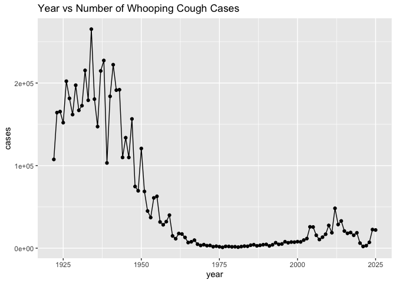
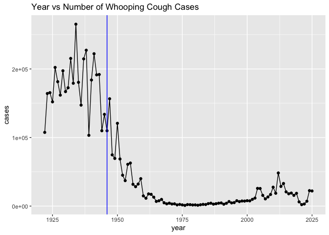
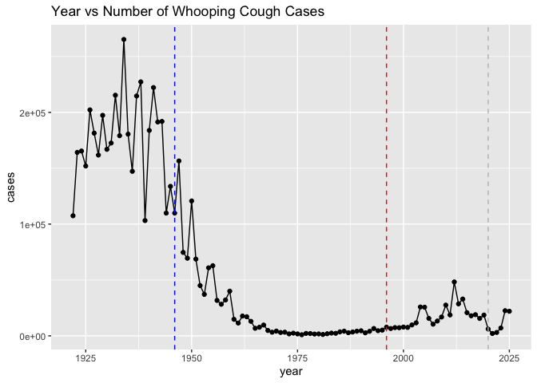
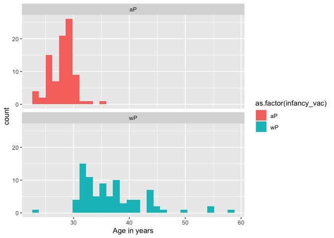
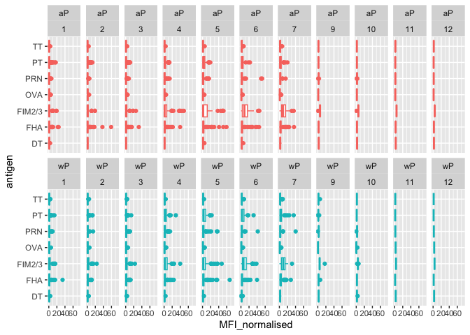
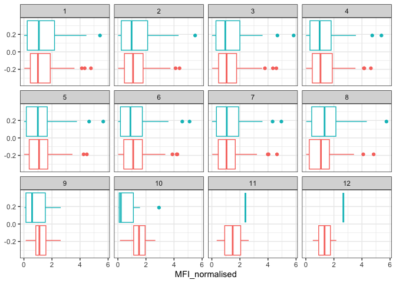
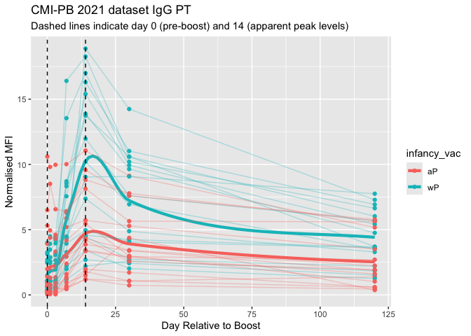
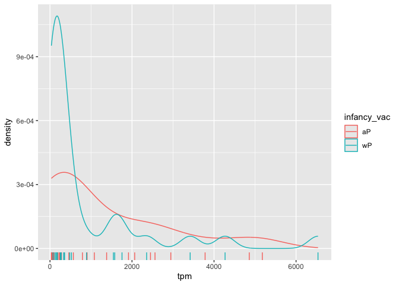

# class18
Malibu Slattery (A18488012)

- [Pertussis and the CMI-PB project](#pertussis-and-the-cmi-pb-project)
- [Background](#background)
- [A tale of two vaccines (wP & aP)](#a-tale-of-two-vaccines-wp--ap)
  - [Exploring CMI-PB data](#exploring-cmi-pb-data)
- [The CMI-PB API returns JSON data](#the-cmi-pb-api-returns-json-data)
- [Side-Note: Working with dates](#side-note-working-with-dates)
- [Joining multiple tables](#joining-multiple-tables)
  - [Examine IgG Ab titer levels](#examine-igg-ab-titer-levels)
- [Obtaining CMI-PB RNASeq data](#obtaining-cmi-pb-rnaseq-data)

## Pertussis and the CMI-PB project

# Background

Pertussis/whooping cough is a lung infection caused by bacteria B. It
can infect anyone but is most deadly for infants under 1 year of age.

\#CDC tracking data The CDC

> Q1. With the help of the R “addin” package datapasta assign the CDC
> pertussis case number data to a data frame called cdc and use ggplot
> to make a plot of cases numbers over time.

``` r
library(ggplot2)

ggplot(cdc, aes(x=year, y = cases)) + geom_point() + geom_line() + labs(title = "Year vs Number of Whooping Cough Cases")
```



# A tale of two vaccines (wP & aP)

> Q2. Using the ggplot geom_vline() function add lines to your previous
> plot for the 1946 introduction of the wP vaccine and the 1996 switch
> to aP vaccine (see example in the hint below). What do you notice?

``` r
ggplot(cdc, aes(x=year, y = cases)) + geom_point() + geom_line() + labs(title = "Year vs Number of Whooping Cough Cases") + geom_vline(xintercept=1946, col = "blue")
```



> Q3. Describe what happened after the introduction of the aP vaccine?
> Do you have a possible explanation for the observed trend?

``` r
ggplot(cdc, aes(x=year, y = cases)) + geom_point() + geom_line() + labs(title = "Year vs Number of Whooping Cough Cases") + geom_vline(xintercept=1946, col = "blue", lty = 2) + geom_vline(xintercept=1996, col = "red", lty = 2) + geom_vline(xintercept=2020, col = "grey", lty = 2) 
```



The initial decrease after 1946 was from the inital strong reaction and
protection against the virus. On the other hand, after 1996, less people
may be getting vaccinated. Waning efficacy of the aP vaccine. There
seems to be a 10 year lag in spikes of cases.

## Exploring CMI-PB data

# The CMI-PB API returns JSON data

The mission of CMI-PB is to provide the scientific community with a
comprehensive, high-quality and freely accessible resource of Pertussis
booster vaccination.

They made their data available in the format API. We can read this into
R with the `read_json()` function from the **jsonlite** package.

``` r
library(jsonlite)
```

``` r
subject <- read_json("https://www.cmi-pb.org/api/subject", simplifyVector = TRUE) 
```

``` r
head(subject, 3)
```

      subject_id infancy_vac biological_sex              ethnicity  race
    1          1          wP         Female Not Hispanic or Latino White
    2          2          wP         Female Not Hispanic or Latino White
    3          3          wP         Female                Unknown White
      year_of_birth date_of_boost      dataset
    1    1986-01-01    2016-09-12 2020_dataset
    2    1968-01-01    2019-01-28 2020_dataset
    3    1983-01-01    2016-10-10 2020_dataset

> Q4. How many aP and wP infancy vaccinated subjects are in the dataset?

``` r
table(subject$infancy_vac)
```


    aP wP 
    87 85 

> Q5. How many Male and Female subjects/patients are in the dataset?

``` r
table(subject$biological_sex)
```


    Female   Male 
       112     60 

> Q6. What is the breakdown of race and biological sex (e.g. number of
> Asian females, White males etc…)? eg:`biological_sex` and `race`…is
> this representitve of the US populatio

``` r
table(subject$race, subject$biological_sex)
```

                                               
                                                Female Male
      American Indian/Alaska Native                  0    1
      Asian                                         32   12
      Black or African American                      2    3
      More Than One Race                            15    4
      Native Hawaiian or Other Pacific Islander      1    1
      Unknown or Not Reported                       14    7
      White                                         48   32

# Side-Note: Working with dates

``` r
library(lubridate)
```


    Attaching package: 'lubridate'

    The following objects are masked from 'package:base':

        date, intersect, setdiff, union

``` r
today()
```

    [1] "2026-03-12"

``` r
today() - ymd("2000-01-01")
```

    Time difference of 9567 days

``` r
time_length( today() - ymd("2000-01-01"),  "years")
```

    [1] 26.19302

> Q7. Using this approach determine (i) the average age of wP
> individuals, (ii) the average age of aP individuals; and (iii) are
> they significantly different?

``` r
library(dplyr)
```


    Attaching package: 'dplyr'

    The following objects are masked from 'package:stats':

        filter, lag

    The following objects are masked from 'package:base':

        intersect, setdiff, setequal, union

``` r
subject$age <- today() - ymd(subject$year_of_birth)

wp <- subject |> filter(infancy_vac=="wP")

round( summary( time_length( wp$age, "years" ) ) )
```

       Min. 1st Qu.  Median    Mean 3rd Qu.    Max. 
         23      33      35      37      40      58 

``` r
ap <- subject |> filter(infancy_vac=="aP")

round( summary( time_length( ap$age, "years" ) ) )
```

       Min. 1st Qu.  Median    Mean 3rd Qu.    Max. 
         23      27      28      28      29      35 

They are significantly different because there may be more available
data to test the vaccines on younger individuals.

> Q8. Determine the age of all individuals at time of boost?

``` r
int <- ymd(subject$date_of_boost) - ymd(subject$year_of_birth)
age_at_boost <- time_length(int, "year")
head(age_at_boost)
```

    [1] 30.69678 51.07461 33.77413 28.65982 25.65914 28.77481

> Q9. With the help of a faceted boxplot or histogram (see below), do
> you think these two groups are significantly different?

``` r
ggplot(subject) +
  aes(time_length(age, unit="year"),
      fill=as.factor(infancy_vac)) +
  geom_histogram(show.legend=TRUE) +
  facet_wrap(vars(infancy_vac), nrow=2) +
  xlab("Age in years")
```

    `stat_bin()` using `bins = 30`. Pick better value `binwidth`.



``` r
x <- t.test(time_length( wp$age, "years" ),
       time_length( ap$age, "years" ))

x$p.value
```

    [1] 2.372101e-23

# Joining multiple tables

We can read more tables from the CBI-PB database

``` r
specimen <- read_json("http://cmi-pb.org/api/v5_1/specimen", simplifyVector=T)
ab_titer <- read_json("http://cmi-pb.org/api/v5_1/plasma_ab_titer", simplifyVector =T)
```

``` r
head(specimen)
```

      specimen_id subject_id actual_day_relative_to_boost
    1           1          1                           -3
    2           2          1                            1
    3           3          1                            3
    4           4          1                            7
    5           5          1                           11
    6           6          1                           32
      planned_day_relative_to_boost specimen_type visit
    1                             0         Blood     1
    2                             1         Blood     2
    3                             3         Blood     3
    4                             7         Blood     4
    5                            14         Blood     5
    6                            30         Blood     6

``` r
head(ab_titer)
```

      specimen_id isotype is_antigen_specific antigen        MFI MFI_normalised
    1           1     IgE               FALSE   Total 1110.21154       2.493425
    2           1     IgE               FALSE   Total 2708.91616       2.493425
    3           1     IgG                TRUE      PT   68.56614       3.736992
    4           1     IgG                TRUE     PRN  332.12718       2.602350
    5           1     IgG                TRUE     FHA 1887.12263      34.050956
    6           1     IgE                TRUE     ACT    0.10000       1.000000
       unit lower_limit_of_detection
    1 UG/ML                 2.096133
    2 IU/ML                29.170000
    3 IU/ML                 0.530000
    4 IU/ML                 6.205949
    5 IU/ML                 4.679535
    6 IU/ML                 2.816431

make sense of all this data we need to “join” (aka merge or link) all
these tables together. Only then will you know that a given Ab
measurement(from the `ab_titer` table) was collected on a certain date
from the `specimen` table from a certain cP or aP subject from the
`subject` table.

We can use **dplyr** and the `*_join()` family of functions to do this.

> Q9. Complete the code to join specimen and subject tables to make a
> new merged data frame containing all specimen records along with their
> associated subject details:

``` r
library(dplyr)
meta <- inner_join(subject, specimen)
```

    Joining with `by = join_by(subject_id)`

``` r
head(meta)
```

      subject_id infancy_vac biological_sex              ethnicity  race
    1          1          wP         Female Not Hispanic or Latino White
    2          1          wP         Female Not Hispanic or Latino White
    3          1          wP         Female Not Hispanic or Latino White
    4          1          wP         Female Not Hispanic or Latino White
    5          1          wP         Female Not Hispanic or Latino White
    6          1          wP         Female Not Hispanic or Latino White
      year_of_birth date_of_boost      dataset        age specimen_id
    1    1986-01-01    2016-09-12 2020_dataset 14680 days           1
    2    1986-01-01    2016-09-12 2020_dataset 14680 days           2
    3    1986-01-01    2016-09-12 2020_dataset 14680 days           3
    4    1986-01-01    2016-09-12 2020_dataset 14680 days           4
    5    1986-01-01    2016-09-12 2020_dataset 14680 days           5
    6    1986-01-01    2016-09-12 2020_dataset 14680 days           6
      actual_day_relative_to_boost planned_day_relative_to_boost specimen_type
    1                           -3                             0         Blood
    2                            1                             1         Blood
    3                            3                             3         Blood
    4                            7                             7         Blood
    5                           11                            14         Blood
    6                           32                            30         Blood
      visit
    1     1
    2     2
    3     3
    4     4
    5     5
    6     6

Let’s do one more `inner_join` to join the ab_titer with `meta` data…

> Q10. Now using the same procedure join meta with titer data so we can
> further analyze this data in terms of time of visit aP/wP, male/female
> etc.

``` r
abdata<-inner_join(ab_titer, meta)
```

    Joining with `by = join_by(specimen_id)`

``` r
head(abdata)
```

      specimen_id isotype is_antigen_specific antigen        MFI MFI_normalised
    1           1     IgE               FALSE   Total 1110.21154       2.493425
    2           1     IgE               FALSE   Total 2708.91616       2.493425
    3           1     IgG                TRUE      PT   68.56614       3.736992
    4           1     IgG                TRUE     PRN  332.12718       2.602350
    5           1     IgG                TRUE     FHA 1887.12263      34.050956
    6           1     IgE                TRUE     ACT    0.10000       1.000000
       unit lower_limit_of_detection subject_id infancy_vac biological_sex
    1 UG/ML                 2.096133          1          wP         Female
    2 IU/ML                29.170000          1          wP         Female
    3 IU/ML                 0.530000          1          wP         Female
    4 IU/ML                 6.205949          1          wP         Female
    5 IU/ML                 4.679535          1          wP         Female
    6 IU/ML                 2.816431          1          wP         Female
                   ethnicity  race year_of_birth date_of_boost      dataset
    1 Not Hispanic or Latino White    1986-01-01    2016-09-12 2020_dataset
    2 Not Hispanic or Latino White    1986-01-01    2016-09-12 2020_dataset
    3 Not Hispanic or Latino White    1986-01-01    2016-09-12 2020_dataset
    4 Not Hispanic or Latino White    1986-01-01    2016-09-12 2020_dataset
    5 Not Hispanic or Latino White    1986-01-01    2016-09-12 2020_dataset
    6 Not Hispanic or Latino White    1986-01-01    2016-09-12 2020_dataset
             age actual_day_relative_to_boost planned_day_relative_to_boost
    1 14680 days                           -3                             0
    2 14680 days                           -3                             0
    3 14680 days                           -3                             0
    4 14680 days                           -3                             0
    5 14680 days                           -3                             0
    6 14680 days                           -3                             0
      specimen_type visit
    1         Blood     1
    2         Blood     1
    3         Blood     1
    4         Blood     1
    5         Blood     1
    6         Blood     1

> Q11. How many different Ab isotype values are there in this dataset?

``` r
sometable<-table(abdata$isotype, abdata$infancy_vac)
```

> Q12. How many different “antigen” values are measured?

``` r
table(abdata$antigen)
```


        ACT   BETV1      DT   FELD1     FHA  FIM2/3   LOLP1     LOS Measles     OVA 
       1970    1970    6318    1970    6712    6318    1970    1970    1970    6318 
        PD1     PRN      PT     PTM   Total      TT 
       1970    6712    6712    1970     788    6318 

Let’s focus on IgG isotype…

## Examine IgG Ab titer levels

``` r
igg <-abdata |> 
          filter(isotype=="IgG")
#igg
```

Make a plot of `MFI_normalised` values for all `antigen` values.

> Q13. Complete the following code to make a summary boxplot of Ab titer
> levels (MFI) for all antigens:

``` r
ggplot(igg, aes(x=MFI_normalised, y = antigen)) + geom_boxplot()
```


The antigens `PT` and `FIM2/3` AND `FHA` appear to have the widest range
of values.

> Q14. What antigens show differences in the level of IgG antibody
> titers recognizing them over time? Why these and not others?

``` r
ggplot(igg, aes(x=MFI_normalised, y = antigen)) + geom_boxplot() + facet_wrap(~ infancy_vac)
```


Is there a difference with time (i.e. before booster vs after booster)?

``` r
ggplot(igg, aes(x=MFI_normalised, y = antigen, col = infancy_vac)) + geom_boxplot() + facet_wrap(~ visit)
```


``` r
igg |> filter(visit != 8) %>%
ggplot() +
  aes(MFI_normalised, antigen, col=infancy_vac ) +
  geom_boxplot(show.legend = FALSE) + 
  xlim(0,75) +
  facet_wrap(vars(infancy_vac, visit), nrow=2)
```

    Warning: Removed 5 rows containing non-finite outside the scale range
    (`stat_boxplot()`).



> Q15. Filter to pull out only two specific antigens for analysis and
> create a boxplot for each. You can chose any you like. Below I picked
> a “control” antigen (“OVA”, that is not in our vaccines) and a clear
> antigen of interest (“PT”, Pertussis Toxin, one of the key virulence
> factors produced by the bacterium B. pertussis).

``` r
filter(igg, antigen=="OVA") |>
  ggplot() +
  aes(MFI_normalised, col=infancy_vac) +
  geom_boxplot(show.legend = FALSE) +
  facet_wrap(vars(visit)) +
  theme_bw()
```



``` r
filter(igg, antigen=="FIM2/3") |>
  ggplot() +
  aes(MFI_normalised, col=infancy_vac) +
  geom_boxplot(show.legend = FALSE) +
  facet_wrap(vars(visit)) +
  theme_bw()
```


> Q16. What do you notice about these two antigens time courses and the
> PT data in particular? ans: There is a peak in PT data at visit 4-5,
> but goes down significantly after that, showing how much more
> effective it is than the OVA.

> Q17. Do you see any clear difference in aP vs. wP responses? ans: Not
> extreme differences, but the wP responses seem to be higher in days 5
> and 6.

``` r
ab.PT.21 <- abdata |>
    filter(dataset=="2021_dataset", isotype == "IgG", antigen == "PT")

  ggplot(ab.PT.21) +
    aes(x=planned_day_relative_to_boost,
        y=MFI_normalised,
        col=infancy_vac,
        group=subject_id) +
        geom_point()+
    geom_smooth(aes(x = planned_day_relative_to_boost, y = MFI_normalised, group = infancy_vac), se= FALSE, , size = 1.5, span = .3) +
    geom_line(alpha = .3) +
    geom_vline(xintercept=0, linetype="dashed") +
    geom_vline(xintercept=14, linetype="dashed") +
  labs(title="CMI-PB 2021 dataset IgG PT",
       subtitle = "Dashed lines indicate day 0 (pre-boost) and 14 (apparent peak levels)") + xlab("Day Relative to Boost") + ylab("Normalised MFI")
```

    Warning: Using `size` aesthetic for lines was deprecated in ggplot2 3.4.0.
    ℹ Please use `linewidth` instead.

    Warning in simpleLoess(y, x, w, span, degree = degree, parametric = parametric,
    : pseudoinverse used at -0.6

    Warning in simpleLoess(y, x, w, span, degree = degree, parametric = parametric,
    : neighborhood radius 3.6

    Warning in simpleLoess(y, x, w, span, degree = degree, parametric = parametric,
    : reciprocal condition number 0

    Warning in simpleLoess(y, x, w, span, degree = degree, parametric = parametric,
    : There are other near singularities as well. 11364

    Warning in simpleLoess(y, x, w, span, degree = degree, parametric = parametric,
    : pseudoinverse used at -0.6

    Warning in simpleLoess(y, x, w, span, degree = degree, parametric = parametric,
    : neighborhood radius 3.6

    Warning in simpleLoess(y, x, w, span, degree = degree, parametric = parametric,
    : reciprocal condition number 0

    Warning in simpleLoess(y, x, w, span, degree = degree, parametric = parametric,
    : There are other near singularities as well. 11364



https://r02pro.github.io/smoothline.html
https://bookdown.dongzhuoer.com/hadley/ggplot2-book/plot-geoms

> Q18. Does this trend look similar for the 2020 dataset? ans: yes, it
> does.

# Obtaining CMI-PB RNASeq data

``` r
url <- "https://www.cmi-pb.org/api/v2/rnaseq?versioned_ensembl_gene_id=eq.ENSG00000211896.7"

rna <- read_json(url, simplifyVector = TRUE) 
```

``` r
meta <- inner_join(specimen, subject)
```

    Joining with `by = join_by(subject_id)`

``` r
ssrna <- inner_join(rna, meta)
```

    Joining with `by = join_by(specimen_id)`

> Q19. Make a plot of the time course of gene expression for IGHG1 gene
> (i.e. a plot of visit vs. tpm).

``` r
ggplot(ssrna) +
  aes(visit, tpm, group=subject_id) +
  geom_point() +
  geom_line(alpha=0.2)
```


> Q20.: What do you notice about the expression of this gene (i.e. when
> is it at it’s maximum level)? ans: the max level is at the 4th visit

> Q21. Does this pattern in time match the trend of antibody titer data?
> If not, why not? ans: this does match the trend of the antibody titer
> data because the response/expression is highest at the 4th visit.

``` r
ggplot(ssrna) +
  aes(tpm, col=infancy_vac) +
  geom_boxplot() +
  facet_wrap(vars(visit))
```


``` r
ssrna %>%  
  filter(visit==4) |>
  ggplot() +
    aes(tpm, col=infancy_vac) + geom_density() + 
    geom_rug() 
```


